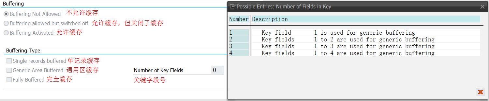

## 基本数据类型
| 类型 | 最大长度（字符数） | 默认长度 | 说明 |
|---|---|---|---|
| C | 1~262143个字符       | 1 字符   | |
| N | 1~262143个字符       | 1 字符   | 0到9之间字符组成的数字字符串 |
| D | 16 bytes             |         | 日期格式必须为 YYYYMMDD |
| T | 12 bytes             |         | 格式为 24-hour的 HHMMSS |
| I | 4 bytes              |         | -2.147.483.648 to +2.147.483.647 |
| F | 8 bytes              |         | 小数位最大可以到17位，即可精确到小数点后17位 |
| P | 1~16 bytes           | 8 bytes | 两个数字位压缩后才占一个字节，由于0-9的数字只需要4Bit位，所以一个字节实质上允许存储二位数字，这就是P数据类型为压缩数据类型的由来。并借用半个字节来存储小数点位置、正号、负号相关信息  如果不指定小数位，则将视为I类型。在使用P类型时，要先选择程序属性中的选项 Fixed point arithmetic（即定点算法，一般默认选中），否则系统将P类型看用整型。其效率低于I或F类型。  最大整数位：16*2 = 32 - 1 = 31 -14(允许最大小数位数) = 17位整数位  正负符号与小数点固定要占用半个字节  可用于精确运算（这里的精确指的是存储中所存储的数据与定义时字面上所看到的大小相同，而不存在精度丢失问题——看到的就是内存中实实在在的大小）|
| X | 1~524,287 bytes      | 1 byte  |十六进制字符 0-9, A-F具体的范围为：00~FF  类型X是十六进制类型，可表示内存字节实际内容，使用两个十六制字符表示一个字节中所存储的内容。但直接打印输出时，输出的还是赋值时字面意义上的值，而不是Unicode解码后的字符  如果未在 DATA 语句中指定参数'length'，则创建长度为 1  注：如果值是字母，则一定要大写 |
> Bits（比特）&emsp;&emsp; Byte（字节B）&emsp;&emsp; 1 字符 = 2 字节 
> 1 Byte = 8 Bits &emsp; 1 KB = 1024 Bytes &emsp; 1 MB = 1024 KB &emsp; 1 GB = 1024 MB &emsp; 1 TB = 1024  GB

<!-- ============================================================分割线=====================================================================-->

## Data element & Domain
> **Data element是构成结构、表的基本组件,Data element主要附带Search Help、Parameter ID、以及标签描述，而类型是由Domain域来决定的。**

> **Domain主要从技术属性方面描述了Data element，如Data Type数据类型、Output Length输出长度、Convers. Routine转换规则、以及Value Range取值范围。**

> **将技术信息从Data element提取出来为Domain域的好处： 技术信息形成的Domain可以共用，而每个表字段的业务含意不一样，会导致其描述标签、搜索帮助不一样，所以牵涉到业务部分的信息直接Data element中进行描述，而与业务无关的技术信息部分则分离出来形成Domain**

<!-- ============================================================分割线=====================================================================-->
## Type & Like
> **TYPE后面跟随的只能是某种类型,而LIKE后面可以跟实例对象。** 

> **参照数据类型（标准表、add-on表、structure、表的栏位）声明变量时，因为可以视作对象，所以既可以用TYPE，也可以用LIKE。**
~~~abap
DATA: lt_marc1 TYPE marc,
      lt_marc2 LIKE marc.

DATA: lt_ftp1 TYPE zbaftpma0001,
      lt_ftp2 LIKE zbaftpma0001.

DATA: l_werks1 TYPE marc-werks,
      l_werks2 LIKE marc-werks.
~~~

> **参照结构体对象生成内表时只能用LIKE,不能用TYPE。**
~~~abap
DATA: BEGIN OF st_marc,
        werks TYPE marc-werks,
        matnr TYPE marc-matnr,
      END OF st_marc.

DATA lt_marc LIKE st_marc.
~~~

> **定义的变量名不能与词典中的类型同名，否则表面上TYPE、LIKE都可以使用，实际上是指向不同的类型。**
~~~abap
DATA: BEGIN OF marc,
        werks TYPE marc-werks,
        matnr TYPE marc-matnr,
      END OF marc.

DATA: lt_marc1 TYPE marc,
      lt_marc2 LIKE marc.
~~~
- 上述例子中，"lt_marc1"参照的是数据字典中的marc，"lt_marc2"参照的是代码前面声明的结构marc。

<!-- ============================================================分割线=====================================================================-->

## 字符串表达式
~~~abap
DATA: str1 TYPE string VALUE 'One Team',
      str2 TYPE string VALUE 'One Goal!'.

WRITE: 'One Team One Goal!',
       / str1 && ` ` && str2,
       / |{ str1 } One Goal!|,
       / |{ str1 } { str2 }|,
       / |{ str1 } { str2 } 这句话一共有： { strlen( str1 && ` ` && str2 ) } 个字符。|.
~~~
**Result:** 

<!-- ============================================================分割线=====================================================================-->

## 字符串常用操作
> **取前N位**

~~~abap
a = a(N). "取前N位
a = a+N(2). "取第N位后的2位
a = a+N . "取第N位后的所有字符
~~~

-----------------------------------------------------------------------------------------------------------------------------------------------

> **`SPLIT` {c} `AT` {del} `INTO` {c1} ... {cn}.** 
> **`SPLIT` {c} `AT` {del} `INTO` TABLE {itab}.**
- 作用：按照分割字符del把字符串c分割成c1…cn或放到内表中的相应字段。

~~~abap
DATA: str1 TYPE string VALUE 'One Team/One Goal!',
      str2 TYPE string VALUE '',
      str3 TYPE string VALUE ''.

SPLIT str1 AT '/' INTO str2 str3.
WRITE: |str2: { str2 }|,
       / |str3: { str3 }|.
~~~

**Result:** 

-----------------------------------------------------------------------------------------------------------------------------------------------

> **`SHIFT` {c} `[BY {n} PLACES]` `[{mode}]`.**
- 作用：位移字符串n个位置的字符，如果n未指定，默认为1，如果指定的n小于等于0，则字符串不变。如果n超出字符串的长度，则字符串变空，所以在做此操作的时候要注意n的指定。可以首先获得该字符串的长度，方法：len＝STRLEN(C)。
- mode：指定字符串位移的方向。
  1. LEFT：从左边位移。
  2. RIGHT：从右边位移'。
  3. CIRCULAR：把左边的字符放到右边。

~~~abap
DATA: str1 TYPE string VALUE 'One Team One Goal!',
      str2 TYPE string VALUE 'One Team One Goal!',
      str3 TYPE string VALUE 'One Team One Goal!'.

SHIFT: str1 BY 8 PLACES LEFT,
       str2 BY 8 PLACES RIGHT,
       str3 BY 8 PLACES CIRCULAR.

WRITE: str1,
       / str2,
       / str3.
~~~

**Result:** 

-----------------------------------------------------------------------------------------------------------------------------------------------

> **`SHIFT` {c} `UP TO` {str} `[{mode}]`.**
- 作用：在字符串{c}中以{str}为起点进行位移，同样可以指定mode，原理同上。

~~~abap
DATA: str1 TYPE string VALUE 'One Team One Goal!',
      str2 TYPE string VALUE 'One Team One Goal!',
      str3 TYPE string VALUE 'One Team One Goal!'.

SHIFT: str1 UP TO 'Team' LEFT,
       str2 UP TO 'Team' RIGHT,
       str3 UP TO 'Team' CIRCULAR.

WRITE: str1,
       / str2,
       / str3.
~~~

**Result:** 

-----------------------------------------------------------------------------------------------------------------------------------------------

> **`SHIFT` {c} `LEFT DELETING LEADING` {str}.** 
> **`SHIFT` {c} `RIGHT DELETING TRAILING` {str}.** 
- 作用：字符串{c}左边的第一个字符或右边的最后一个字符出现在 {str} 中，该语句将字段{c}向左或向右移动。字段右边或左边用空格填充。

~~~abap
DATA: str1 TYPE string VALUE '/20240101/',
      str2 TYPE string VALUE '/20240101/',
      str3 TYPE string VALUE '/20240101/'.

SHIFT str2 LEFT DELETING LEADING '/'.
SHIFT str3 RIGHT DELETING TRAILING '/'.

WRITE: str1,
       / str2,
       / str3.
~~~

**Result:** 

-----------------------------------------------------------------------------------------------------------------------------------------------

> **`CONDENSE` {c} `[NO-GAPS]`.** 
- 作用：去掉字符串中的前面和后面的空格，如果指定NO-GAPS，则去掉字符串中的所有空格。

~~~abap
DATA: str1 TYPE string VALUE ' One Team One Goal! ',
      str2 TYPE string VALUE ' One Team One Goal! ',
      str3 TYPE string VALUE ' One Team One Goal! '.

CONDENSE str2.
CONDENSE str3 NO-GAPS.

WRITE: str1,
       / str2,
       / str3.
~~~
**Result:** 

-----------------------------------------------------------------------------------------------------------------------------------------------

> **`strlen(str)`、`Xstrlen(str)`**
- 作用：计算字符串长度，String类型的尾部空格会纳入计算，但C类型的变量尾部空格不会纳入计算。

~~~abap
DATA: str1 TYPE string VALUE 'One Team One Goal!',
      str2 TYPE c LENGTH 30 VALUE 'One Team One Goal!'.

str1 = |{ str1 }   |.
str2 = |{ str2 }   |.

WRITE: |{ strlen( str1 ) }|,
       / |{ strlen( str2 ) }|.
~~~
**Result:** 

<!-- ============================================================分割线=====================================================================-->

## ABAP的匹配
> **字符串中的通配符**
  1. `*` 多位字符的通配符
  2. `+` 一位字符的通配符
  3. `#` 字符操作中的转义符

> **OPEN SQL where条件中通配符**
  1. `%` 多位字符的通配符
  2. `_` 一位字符的通配符
  3. `ESCAPE` Where条件中转义符

> **CO|CN|CA|NA|CS|NS|CP|NP**

| 语法 | 英文 | 描述 | 含义 | 备注 |
|---|---|---|---|---|
| CO | Contain Only                | 仅包含       | str1中仅含有str2的字符       | 区分大小写，比较尾部空格 |
| CN | Contain Not Only            | 包含以外     | str1中包含str2中以外的字符   | 区分大小写，比较尾部空格 |
| CA | Contain Any                 | 包含任意     | str1中至少包含str2中任一字符 | 区分大小写，比较尾部空格 |
| NA | Contain Not Any             | 不包含任意   | str1中不包含str2中任何的字符 | 区分大小写，比较尾部空格 |
| CS | Contain String              | 包含字符串   | str1中包含str2整个字符串     | 不区分，不比较 |
| NS | Contain Not String          | 不包含字符串 | str1中不包含str2整个字符串   | 不区分，不比较 |
| CP | Conforms To Pattern         | 符合模式     | str1符合str2的模式          | 不区分，不比较 |
| NP | Dose Not Conform To Pattern | 不符合模式   | str1不符合str2的模式        | 不区分，不比较 |

<!-- ============================================================分割线=====================================================================-->

## CLEAR & REFRESH & FREE
> **针对内表< itab >**
- 如果使用带表头的内表，`CLEAR` < itab >仅清除表格工作区域。使用`REFRESH` < itab >或`CLEAR` < itab >[]来清空整个内表。
- `REFRESH` 是专门清楚内表的，`REFRESH` < itab >或`REFRESH` < itab >[]都只清除内表内容，清除基本类型变量用`CLEAR`。
- `CLEAR`和`REFRESH`都不会释放掉内表所占用的空间，如果想初始化内表的同时还要释放所占用的空间，请使用：`FREE` < itab >。

<!-- ============================================================分割线=====================================================================-->

## TABLES & USING & CHANGING
> **TABLES**
- `TYPE`与`LIKE`后面只能接标准内表类型或标准内表对象，如果接排序内表或者哈希内表，只能使用`USING`或`CHANGE`。
- 当`TABLES`接带表头的内表时`（lt_table）`,表头和内表都会被传递过去。
- 当`TABLES`接无表头的内表或只传递了内表时`（lt_table[]）`,系统会自动为内表参数变量创建一个局部空的表头。

> **USING & CHANGING 引用传递时效果一样**
- `USING`

~~~abap
DATA: num1 TYPE i VALUE 100,
      num2 TYPE i VALUE 200,
      num3 TYPE i.

PERFORM add USING num1 num2 num3.

WRITE: |{ num1 } + { num2 } = { num3 }|.

FORM add USING num1 TYPE i
               num2 TYPE i
               num3 TYPE i.
  num3 = num1 + num2.
ENDFORM.
~~~
- `CHANGE`

~~~abap
DATA: num1 TYPE i VALUE 100,
      num2 TYPE i VALUE 200,
      num3 TYPE i.

PERFORM add USING num1 num2 CHANGING num3.

WRITE: |{ num1 } + { num2 } = { num3 }|.

FORM add USING num1 TYPE i
               num2 TYPE i
         CHANGING num3 TYPE i.
  num3 = num1 + num2.
ENDFORM.
~~~
**Result:** 

> **USING & CHANGING 值传递**
- `CHANGING`会在perform执行结束后才修改实参变量，`CHANGING`的引用传递和结果传递的结果时一样的，只是修改时机不一样。

~~~abap
DATA: num1 TYPE i VALUE 100,
      num2 TYPE i VALUE 200,
      num3 TYPE i.

PERFORM add USING num1 num2 CHANGING num3.

WRITE:/ |在子程序外：num1={ num1 } num3= { num3 }|.

FORM add USING VALUE(num1) TYPE i
               VALUE(num2) TYPE i
         CHANGING num3 TYPE i.

  num1 = num1 + num2.
  num3 = num1 + num2.

  WRITE: |在子程序外：num1={ num1 } num3= { num3 }|.
ENDFORM.
~~~
**Result:** 

> **USING & CHANGING 值传递并返回结果**

~~~abap
DATA: num1 TYPE i VALUE 100,
      num2 TYPE i VALUE 200,
      num3 TYPE i.

PERFORM add USING num1 num2 CHANGING num3.

WRITE:/ |子程序执行后：num1={ num1 } num3= { num3 }|.

FORM add USING num1 TYPE i
               num2 TYPE i
         CHANGING VALUE(num4) TYPE i.

  num1 = num1 + num2.
  num4 = num1 + num2.

  WRITE: |子程序执行中：num1={ num1 } num3= { num3 }|.
~~~
**Result:** 

<!-- ============================================================分割线=====================================================================-->

## Database table的三种缓存
> **图示**

> **说明**
 - **单记录缓存：**从数据库中仅读取一条数据并存储到table buffer 中。此缓存只对SELECT SINGLE…语句起作用
 
 - **部分缓存：**
    1. 需要在指定generic key（即关键字段组合，根据哪些关键字段来缓存，可以是部分或全部关键字段）。如果主键是由一个字段构成，则不能选择此类型缓  存。当你使用generic key进行数据访问时，则属于此条件范围的整片数据都会被加载到table buffer中

    2. 查询时如果使用BYPASSING BUFFER 选项，除了绕过缓存直接到数据库查询外，查出的数据不会放入缓存

    3. 只要查询条件中出现了用作缓存区域的所有关键字段，则查询出所有满足条件全部数据进行缓存

    4. 如果查询条件中generic key只出现某个或者某部分，则不会进行缓存操作

    5. 如果主键是只由一个字段组成，则不能设定为此种缓存

    6. 如果有MANDT字段，则为generic key的第一个字段

  - **全部缓存：**在第一次读取表数据时，会将整个表的数据都会缓存下来，不管WHERE条件

<!-- ============================================================分割线=====================================================================-->

## COMMIT WORK
> **异步更新，该语句执行后不会等待所有更新函数都执行完后才继续执行后面的代码。**
~~~abap
COMMIT WORK
~~~
> **同步更新，该语句执行后会等待所有更新函数都执行完后才继续执行后面的代码，执行结果可以通过`sy-subrc`来判断事务提交是否成功。**
~~~abap
COMMIT WORK AND WAIT
~~~

