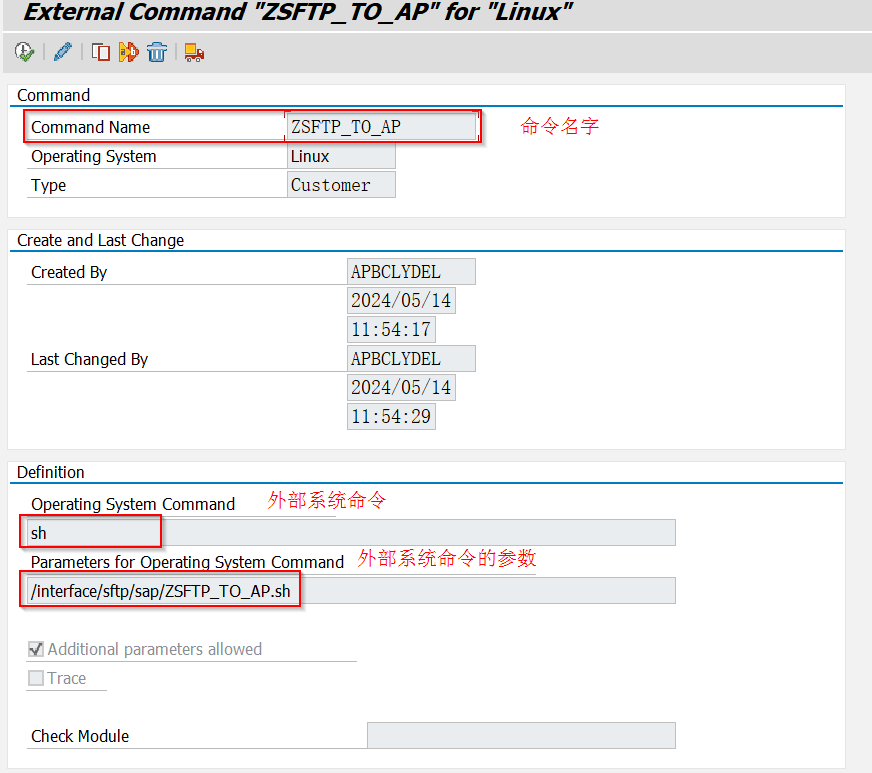

## 上传文档（Excel）

> **代码示例**

```abap
PARAMETERS p_upath LIKE rlgrap-filename.

AT SELECTION-SCREEN ON VALUE-REQUEST FOR p_upath .
  PERFORM get_local_filename CHANGING p_upath.

START-OF-SELECTION.
  PERFORM check_path.
  PERFORM upload_data.

FORM get_local_filename  CHANGING p_fname.
  CALL FUNCTION 'F4_FILENAME'
    IMPORTING
      file_name = p_fname.
ENDFORM.

FORM check_path.
  DATA: l_file TYPE string,
        l_bool TYPE abap_bool.

  IF p_upath IS INITIAL.
    MESSAGE s398(00) WITH 'Local file/path is required' DISPLAY LIKE 'E'.
    STOP.
  ELSE.
    l_file = p_upath.
    CALL METHOD cl_gui_frontend_services=>file_exist
      EXPORTING
        file                 = l_file
      RECEIVING
        result               = l_bool
      EXCEPTIONS
        cntl_error           = 1
        error_no_gui         = 2
        wrong_parameter      = 3
        not_supported_by_gui = 4
        OTHERS               = 5.
    IF sy-subrc <> 0.
      MESSAGE s398(00) WITH 'GUI error when check file exist' DISPLAY LIKE  'E'.
      STOP.
    ELSE.
      IF l_bool = abap_false.
        MESSAGE s398(00) WITH 'File not exit' l_file DISPLAY LIKE 'E'.
        STOP.
      ENDIF.
    ENDIF.
  ENDIF.
ENDFORM.

FORM upload_data .
  DATA: BEGIN OF it_upload OCCURS 0,
          matnr LIKE mara-matnr,
        END OF it_upload.

  DATA: lt_excel  TYPE TABLE OF alsmex_tabline,
        lst_excel TYPE alsmex_tabline,
        l_tabix1  LIKE sy-tabix,
        lst_tab   LIKE it_upload.

  CONSTANTS: c_bcol TYPE i VALUE '1',
             c_brow TYPE i VALUE '2',
             c_ecol TYPE i VALUE '1',
             c_erow TYPE i VALUE '65535'.

  FIELD-SYMBOLS: <field> TYPE any.

  CLEAR: it_upload, it_upload[].

  CALL FUNCTION 'ALSM_EXCEL_TO_INTERNAL_TABLE'
    EXPORTING
      filename                = p_upath
      i_begin_col             = c_bcol  "从第几列开始
      i_begin_row             = c_brow  "从第几行开始
      i_end_col               = c_ecol  "到第几列为止
      i_end_row               = c_erow  "到第几行为止
    TABLES
      intern                  = lt_excel
    EXCEPTIONS
      inconsistent_parameters = 1
      upload_ole              = 2
      OTHERS                  = 3.
  IF sy-subrc <> 0.
    MESSAGE s398(00) DISPLAY LIKE 'E'  WITH 'Upload file fail!'.
    STOP.
  ENDIF.

  IF lt_excel[] IS INITIAL.
    MESSAGE s398(00) DISPLAY LIKE 'E' WITH 'No data in upload file!'..
    STOP.
  ENDIF.

  LOOP AT lt_excel INTO lst_excel.

    AT NEW row.
      l_tabix1 = sy-tabix.
    ENDAT.

    AT END OF row.
      DO.
        ASSIGN COMPONENT sy-index OF STRUCTURE lst_tab TO <field>.
        IF sy-subrc = 0.
          READ TABLE lt_excel INDEX l_tabix1 INTO lst_excel.
          IF sy-subrc = 0 AND lst_excel-col = sy-index.
            TRANSLATE lst_excel-value TO UPPER CASE.
            CONDENSE lst_excel-value.
            <field> = lst_excel-value.
            ADD 1 TO l_tabix1.
          ENDIF.
        ELSE.
          EXIT.
        ENDIF.
      ENDDO.

      IF lst_tab IS NOT INITIAL.
        MOVE-CORRESPONDING lst_tab TO it_upload.
        APPEND: it_upload.
      ENDIF.
      CLEAR: it_upload.
    ENDAT.
  ENDLOOP.

  IF it_upload[] IS INITIAL.
    MESSAGE s398(00) WITH 'No data upload, please check the file!' DISPLAY LIKE 'E'.
    STOP.
  ENDIF.
ENDFORM.
```

## ALV Report（Function）

> **代码示例**

```abap
DATA: it_fieldcat TYPE slis_t_fieldcat_alv WITH HEADER LINE,
      it_layout   TYPE slis_layout_alv.

DATA it_report LIKE TABLE OF marc WITH HEADER LINE.

START-OF-SELECTION.
  PERFORM get_data.
  PERFORM show_report.

FORM get_data.
  SELECT werks matnr
    INTO CORRESPONDING FIELDS OF TABLE it_report
    FROM v_marc_md
   WHERE werks = 'F0A0'.
ENDFORM.

FORM show_report .
  PERFORM get_field_name.
  PERFORM build_layout.
  PERFORM display_alv.
ENDFORM.

FORM get_field_name .
  CLEAR sy-tabix.
  DEFINE fieldcatset.
    it_fieldcat-fieldname   = &1.    "Field name
    it_fieldcat-seltext_l   = &2.    "Field description long

    APPEND it_fieldcat.
    CLEAR it_fieldcat.
  END-OF-DEFINITION.

  fieldcatset 'werks'   'Plant'.
  fieldcatset 'matnr'   'Material'.
ENDFORM.

FORM build_layout .
  DATA l_f2code LIKE sy-ucomm VALUE '&ETA'.

  it_layout-f2code            = l_f2code.
  it_layout-zebra             = 'X'.
  it_layout-detail_popup      = 'X'.
  it_layout-colwidth_optimize = 'X'.
ENDFORM.

FORM display_alv .
  CALL FUNCTION 'REUSE_ALV_GRID_DISPLAY'
    EXPORTING
      i_callback_program = sy-repid
      is_layout          = it_layout
      it_fieldcat        = it_fieldcat[]
      i_save             = 'A'
    TABLES
      t_outtab           = it_report
    EXCEPTIONS
      program_error      = 1
      OTHERS             = 2.
  IF sy-subrc <> 0.
    MESSAGE s398(00) WITH 'Error when output data in ALV format.'.
    STOP.
  ENDIF.
ENDFORM.
```

> **Layout的相关属性**

**1. 公共部分：**

| 字段名称       | 描述                              | 输入值                           | 备注                    |
| -------------- | --------------------------------- | -------------------------------- | ----------------------- |
| no_colhead(1)  | 不显示标题                        | X-不显示，space-显示             |                         |
| no_hotspot(1)  | 标题不设热点                      | X-没有，space-有                 |                         |
| zebra(1)       | 使ALV表格按斑马线间隔条码方式显示 | X-有，space-没有                 |                         |
| no_vline(1)    | 设置列间竖线                      | X-不显示，space-显示             |                         |
| no_hline(1)    | 设置行间隔线                      | X-不显示，space-显示             |                         |
| cell_merge(1)  | 设置是否压域复制                  | X-可复制，space-不可复制         |                         |
| edit(1)        | 设置所有单元格可编辑              | X-可编辑，space-不可编辑         |                         |
| edit_mode(1)   | 编辑模式                          |                                  |                         |
| numc_sum(1)    | 设置仅NUMC类型字段进行总计        | X-仅Numc类型，space-不仅Numc类型 |                         |
| no_input(1)    | 不允许输入，用于显示状态          | X-不允许，space-允许             |                         |
| f2code         | 设置触发弹出详细信息窗口的功能码  | sy-ucomm                         | ‘&ETA’ – 双击        |
| no_keyfix (1)  | 关键字不固定，可以随滚动条滚动    | X-不固定，space-固定             |                         |
| expand_all (1) | 展开所有的node                    |                                  | 对hierarchy ALV函数而言 |
| no_author (1)  | 设置是否需要系统标准权限检查      | X-不需要，space-需要             |                         |

**2. ALV菜单栏：**

| 字段名称       | 描述         | 输入值             | 备注                        |
| -------------- | ------------ | ------------------ | --------------------------- |
| def_status (1) | 默认菜单状态 | A显示，space不显示 | ‘A’ – 为显示所有标准菜单 |
| item_text (20) | 菜单按钮文本 |                    |                             |
| countfname (1) |              | lvc_fname          |                             |

**3. 显示选项：**

| 字段名称             | 描述                    | 输入值                  | 备注        |
| -------------------- | ----------------------- | ----------------------- | ----------- |
| colwidth_optimize(1) | 优化列宽设置            | X-优化                  | 默认：space |
| no_min_linesize(1)   | 设置不允许最小宽度      | X-不允许，space-允许    | 默认：space |
| min_linesize         | ALV列表的最小宽度       | sy-linsz，取值10到250   | 可选参数    |
| max_linesize         | ALV列表的最大宽度       | sy-linsz，可取值80-1020 | 默认值250   |
| window_titlebar      | 窗口标题                | sy-title                |             |
| no_uline_hs(1)       | 输出ALV表不显示水平格线 | X-不显示，space-显示    |             |

**4. 红绿灯显示：**

| 字段名称         | 描述                                         | 输入值                      | 备注 |
| ---------------- | -------------------------------------------- | --------------------------- | ---- |
| lights_fieldname | 输出内表中定义的字段名，该字段用来显示状态灯 | 1：red，2：yellow，3：green |      |
| lights_tabname   | 输出字段的参考内表名称                       |                             |      |
| lights_rollname  | 数据元素的名称，在灯字段按F1触发             |                             |      |
| lights_condense  | 对输出的内表分类汇总的时候，小计行显示状态灯 | X                           |      |

**5. 汇总合计：**

| 字段名称            | 描述                           | 输入值 | 备注 |
| ------------------- | ------------------------------ | ------ | ---- |
| no_sumchoice (1)    | 不能进行选择总计               |        |      |
| no_totalline (1)    | 不能总计，但可以小计           |        |      |
| no_subchoice (1)    | 不能选择小计，但可以总计       |        |      |
| no_subtotals (1)    | 不能小计，但可以总计           |        |      |
| no_unit_splitting   | 有单位字段，不进行总计         |        |      |
| totals_before_items | 总行将会显示在最前面           |        |      |
| totals_only (1)     | 仅显示合计                     |        |      |
| totals_text (60)    | 合计，第一列显示的文本         |        |      |
| subtotals_text (60) | 总计和小计行，第一列显示的文本 |        |      |

**6. 交互：**

| 字段名称              | 描述                            | 输入值 | 备注           |
| --------------------- | ------------------------------- | ------ | -------------- |
| box_fieldname         | 设置ALV表格是否显示选择按钮栏位 |        |                |
| box_tabname           | box_fieldname 参考内表名称      |        |                |
| box_rollname          | 下拉框按钮名称                  |        |                |
| expand_fieldname      | ’展开’字段名称                |        |                |
| hotspot_fieldname     | 热点字段                        |        |                |
| confirmation_prompt   | 退出ALV列表的确认对话框         |        |                |
| key_hotspot (1)       | 关键字段作为热点                |        |                |
| flexible_key (1)      | 关键字段可以移动                |        |                |
| group_buttons (1)     | COL1 – COL5 按钮组             |        |                |
| get_selinfos (1)      | 获取选择屏幕                    |        |                |
| group_change_edit (1) | 设置用户新的按钮组              |        |                |
| no_scrolling(1)       | 滚动条无效，清单不随其滚动      |        | 仅list_alv有效 |

**7. 明细窗口：**

| 字段名称                | 描述                   | 输入值                   | 备注           |
| ----------------------- | ---------------------- | ------------------------ | -------------- |
| detail_popup (1)        | 行项目明细弹窗形式     | X-显示，space-不显示     | 对list_alv有效 |
| detail_initial_lines(1) | 明细中同时显示初始化行 | X-同时显示，space-不显示 |                |
| detail_titlebar         | 明细窗口标题文本       | sy-title                 |                |

**8. 显示变式：**

| 字段名称         | 描述               | 输入值               | 备注 |
| ---------------- | ------------------ | -------------------- | ---- |
| header_text      | 表头按钮           |                      |      |
| default_item (1) | 列表明细作为默认值 | X-显示，space-不显示 |      |

**9. 颜色：**

| 字段名称         | 描述                                                        | 输入值    | 备注                                                                                                         |
| ---------------- | ----------------------------------------------------------- | --------- | ------------------------------------------------------------------------------------------------------------ |
| info_fieldname   | 用于设置ALV输出报表每一行的颜色，其参数为输出内表的栏位名称 | C000~C999 | 倘若其数据输出内表名为LT_OUT，则需要在改内表增加一个栏位“COLOR”，并为内表每行赋值，LT_OUT-COLOR = ‘C500’ |
| coltab_fieldname | 颜色值                                                      |           |                                                                                                              |

**10. 其他：**

| 字段名称             | 描述                           | 输入值     | 备注 |
| -------------------- | ------------------------------ | ---------- | ---- |
| list_append          | 设置是否Call屏幕               |            |      |
| xifunckey            | eXtended interaction(SAPQuery) |            |      |
| xidirect             | eXtended INTeraction(SAPQuery) |            |      |
| dtc_layout           | 设置Tabstip的布局格式配置      | DTC_S_LAYO |      |
| allow_switch_to_list | 设置从Grid模式转换为List模式   |            |      |

> **Fieldcat的相关属性**

| 字段名称              | 描述                                                                                        | 输入值                     | 备注                       |
| --------------------- | ------------------------------------------------------------------------------------------- | -------------------------- | -------------------------- |
| row_pos               | 输出行位置                                                                                  | 1….n                      |                            |
| col_pos               | 输出列位置                                                                                  | 1….n                      |                            |
| fieldname             | 字段名称                                                                                    |                            |                            |
| tabname               | fieldname字段对应的内表名称                                                                 |                            |                            |
| currency              | 货币单位                                                                                    |                            |                            |
| cfieldname            | 当前输出内表中的货币单位字段的字段名称                                                      |                            |                            |
| ctabname              | Cfieldname字段值对应的内表名称                                                              |                            |                            |
| ifieldname            |                                                                                             |                            |                            |
| quantity              | 计量单位                                                                                    |                            |                            |
| qfieldname            | 参考计量单位的字段名称                                                                      |                            |                            |
| qtabname              | Qfieldname对应的输出内表名                                                                  |                            |                            |
| round                 | 四舍五入保留位数                                                                            |                            |                            |
| exponent              | 流动表示的指数                                                                              |                            |                            |
| key(1)                | 将栏位设置为Key值                                                                           |                            |                            |
| icon(1)               | 将定义栏位以ICON的形式显示                                                                  |                            |                            |
| symbol(1)             | 作为Symbol符号输出， 在ALV输出内表中的字段值可以是ABAP名称                                  |                            |                            |
| checkbox(1)           | 作为复选框输出                                                                              |                            |                            |
| just(1)               | 定义栏位对齐方式                                                                            | (R)Right (L)Left (C)Center |                            |
| lzero(1)              | 输出前置零                                                                                  |                            |                            |
| no_sign(1)            | 不输出正负号+、-                                                                            |                            |                            |
| no_zero(1)            | 如果取值为零，则为空，既不输出零                                                            |                            |                            |
| no_convext(1)         |                                                                                             |                            |                            |
| edit_mask             | 输出编辑掩码, 同write语句中的edit mas格式是一样的                                           |                            | 一般用来格式化时间和日期等 |
| emphasize(4)          | 设置栏位的颜色                                                                              |                            |                            |
| fix_column(1)         | 固定列                                                                                      |                            |                            |
| do_sum(1)             | 对当前列输出时自动求和                                                                      |                            |                            |
| no_out(1)             | 当前列隐藏输出                                                                              |                            |                            |
| tech(1)               | 技术字段，设置’X’后，该字段不会显示， 也不能输出，如同MANDT字段一样的效果                 |                            |                            |
| outputlen             | 列的字符宽度                                                                                |                            |                            |
| offset                | 偏移量                                                                                      |                            |                            |
| seltext_l / scrtext_l | 长文本                                                                                      |                            |                            |
| seltext_m / scrtext_m | 中文本                                                                                      |                            |                            |
| seltext_s / scrtext_s | 短文本                                                                                      |                            |                            |
| ddictxt(1)            | 列标题描述格式                                                                              | (S)hort (M)iddle (L)ong    |                            |
| rollname              |                                                                                             |                            |                            |
| datatype              | 数据类型                                                                                    |                            |                            |
| inttype               | 整型                                                                                        |                            |                            |
| intlen                | 整型长度                                                                                    |                            |                            |
| lowercase             | 是否允许小写字母                                                                            |                            |                            |
| decfloat_style        | 浮点格式                                                                                    |                            |                            |
| ref_fieldname         | 参考字段名称，配合ref_tabname一起使用， 一般用来使单元格生成F4帮助                          |                            |                            |
| ref_tabname           | 参考表名称，配合ref_fieldname使用                                                           |                            |                            |
| roundfieldname        | 四舍五入字段名称                                                                            |                            |                            |
| roundtabname          | 四舍五入内表名称                                                                            |                            |                            |
| decimalsfieldname     | 小数点字段名称                                                                              |                            |                            |
| decimalstabname       | 小数点内表名称                                                                              |                            |                            |
| decimals_out(6)       | 控制小数点的位数                                                                            |                            |                            |
| text_fieldname        | 文本字段名称                                                                                |                            |                            |
| reptext_ddic          | 与数据元素的主标题类似                                                                      |                            |                            |
| ddic_outputlen        | 数据字典输出长度                                                                            |                            |                            |
| key_sel(1)            | 这个参数只和设置了Key的字段相关，和Key一起使用可以交互式的隐藏设置为Key的字段(alv_list有效) |                            |                            |
| no_sum(1)             | 不自动汇总                                                                                  |                            |                            |
| sp_group(4)           | 分组需求                                                                                    |                            |                            |
| reprep(1)             | selection for rep/rep                                                                       |                            |                            |
| input(1)              | 输入                                                                                        |                            |                            |
| edit(1)               | 编辑                                                                                        |                            |                            |
| hotspot(1)            | 设置栏位是否有热点（热点栏位显示有下划线）                                                  |                            |                            |

## Download file from SFTP to AP

> 脚本示例：<a href="/Docs\ABAP\file\ZSFTP_TO_AP.sh" target="_blank">`下载`</a>

```shell
#! /bin/bash

###
# @Author: Ver Ver_Guo@wistron.com
# @Date: 2023-09-05 11:24:51
# @LastEditors: Clyde Clyde_Liu@wistron.com
# @LastEditTime: 2024-05-14 11:16:35 Overwrite by github copilot
# @Description: Download file from SFTP server to AP server
###

# -h host
# -p port
# -u username
# -w password
# -o original sftp file path            -b /root/aaa.txt
# -of
# -t target AP server file path         -b /root/aaa.txt
# -tf
# -b back up file path in original server -b /root/aaa.txt  --TBD
# -z compress file or not   -z X                            --TBD
# -ctp  connect type ssh-dss
# Usage: ZBAMA024_SFTP_O_2.sh -h 10.30.118.xxx -u wksvxx -w  xxxx -o /interface/temp/ -t /interface/sftp/sap/ -of F601.txt -tf vgtest.txt -ctp ssh-dss

declare -A parameters=()

checkParameter() {
    local parameter=$1
    local message=$2
    if [ "${parameters[$parameter]+x}" != "x" ]; then
        echo "$message"
        exit 1
  fi
}

getParameters() {
    local idx=0
    local p=""
    for i in "$@"; do
        ((idx++))
        if ((idx == 1)); then
            continue
    fi

        if ((idx % 2 != 0)); then
            case "$p" in
            "-h") parameters["host"]=$i ;;
            "-p") parameters["port"]=$i ;;
            "-u") parameters["username"]=$i ;;
            "-w") parameters["password"]=$i ;;
            "-o") parameters["ori_fpath"]=$i ;;
            "-of") parameters["ori_fname"]=$i ;;
            "-t") parameters["target_fpath"]=$i ;;
            "-tf") parameters["target_fname"]=$i ;;
            "-b") parameters["back_up_ori_path"]=$i ;;
            "-z") parameters["compress"]=$i ;;
            # -ctp "ssh-dss"
            "-ctp") parameters["connect_type"]=$i ;;
            *)
                echo "Parameters format error: $p, Please reference format: -h 'xxx' -u 'xxx' -p 'xxx'"
                return 1
                ;;
      esac
    else
            p=$i
    fi
  done
    return 0
}

# error: parse: missing redirection filename
Download_files() {
    local connect_type=$1
    local connect_program=""
    connect_program="set sftp:connect-program 'ssh -F /dev/null -a -x -oStrictHostKeyChecking=no -oUserKnownHostsFile=/dev/null'"

    if [ "$connect_type" = "ssh-dss" ]; then
        connect_program="set sftp:connect-program 'ssh -F /dev/null -a -x -oHostKeyAlgorithms=+ssh-dss -oStrictHostKeyChecking=no -oUserKnownHostsFile=/dev/null'"
  fi

    lftp -d -u "${parameters["username"]}","${parameters["password"]}" sftp://"${parameters["host"]}:${parameters["port"]}" -e "
    set net:max-retries 3
    set net:reconnect-interval-multiplier 1
    set net:reconnect-interval-base 3
    set net:timeout 3
    set xfer:clobber on
    $connect_program
    lcd ${parameters["target_fpath"]} || exit 1
    cd ${parameters["ori_fpath"]} || exit 1
    mget ${parameters["ori_fname"]}
    bye
    "

    if [ $? -eq 0 ]; then
        echo "=======Download file from SFTP to AP server successfully====="
  else
        echo "=======Download failure======="
        exit 1
  fi
}

if ! getParameters parameters "$@"; then
    exit $?
fi

checkParameter "host" "Please provide target SFTP server host!"
checkParameter "username" "Please provide target SFTP server username!"
checkParameter "password" "Please provide target SFTP server password!"
checkParameter "ori_fpath" "Please provide the AP server's file path which you need send!"
checkParameter "ori_fname" "Please provide the AP server's file name which you need send!"
checkParameter "target_fpath" "Please provide target SFTP server path for file storage!"

if [ "${parameters["port"]+x}" != "x" ]; then
    parameters["port"]=22
fi

if [ "${parameters["target_fname"]+x}" != "x" ]; then
    parameters["target_fname"]=${parameters["ori_fname"]}
fi

# send with ${parameters["connect_type"]
Download_files "${parameters["connect_type"]}"

```

> **执行脚本流程**

1. **T-code：SM69创建外部系统命令**



2. **T-code：CG3Z上传脚本文件到AP server**


3. **代码实现：从SFTP传TXT文件到AP并转JSON**

```abap
**&=================================测试从SFTP拿资料=======================================
   DATA: l_server       TYPE zbaftpma0001-ftp_server,
         l_port         TYPE i,
         l_command      TYPE sxpgcolist-parameters,
         l_exitcode     LIKE extcmdexex-exitcode,
         l_dss          TYPE string,
         l_fname        TYPE zrfcfname,
         l_appath       TYPE string,
         l_len          TYPE i,
         l_path         TYPE string,
         l_input_length TYPE i,
         l_bindata_len  TYPE i,
         l_json         TYPE string.

   DATA: lt_exec    TYPE TABLE OF btcxpm WITH HEADER LINE,
         lt_bindata TYPE TABLE OF blob WITH HEADER LINE.

   DATA:BEGIN OF it_file OCCURS 0,
          file TYPE rlgrap-filename,
        END OF it_file.

   DATA: BEGIN OF st_data,
           version_no  TYPE c LENGTH 50,
           bu          TYPE c LENGTH 50,
           odm         TYPE c LENGTH 20,
           item        TYPE c LENGTH 100,
           demand_type TYPE c LENGTH 10,
           demand_date TYPE c LENGTH 50,
           qty         TYPE c LENGTH 20,
           create_time TYPE c LENGTH 30,
         END OF st_data.

   DATA: BEGIN OF wa_json,
           batch_id   TYPE c LENGTH 16,
           batch_size TYPE c LENGTH 10,
           seq_id     TYPE c LENGTH 10,
           seq_size   TYPE c LENGTH 10.
   DATA: data LIKE TABLE OF st_data,
         END OF wa_json.

   DATA lt_parts LIKE TABLE OF it_file WITH HEADER LINE.

*& 从zbaftpma0001获取evcoda = clf716_cpsp werks = f716 的资料放入wa_ftp
   DATA: wa_ftp TYPE zbaftpma0001.

   SELECT SINGLE *
     FROM zbaftpma0001
     INTO CORRESPONDING FIELDS OF wa_ftp
    WHERE evcoda = 'CLF716_SFTP'
      AND werks = 'F716'.

   SELECT SINGLE low
     FROM tvarvc
     INTO l_appath
   WHERE name = 'INTERFACE_TMP_DIR'.

   l_fname = '*.txt'.

   l_len = strlen( l_appath ) - 1.
   IF l_appath+l_len(1) <> '/'.
     l_appath = l_appath && '/'.
   ELSE.
     l_appath = l_appath.
   ENDIF.

   OPEN DATASET l_appath FOR INPUT IN TEXT MODE ENCODING DEFAULT.

*& 拼接sftp command
   DATA(l_n) = find( val = wa_ftp-ftp_server sub = ':' ).
   IF -1 = l_n.
     l_server = wa_ftp-ftp_server.
     l_port = 22.
   ELSE.
     l_server = substring( val = wa_ftp-ftp_server len = l_n ).
     l_n = l_n + 1.
     l_port  = substring( val = wa_ftp-ftp_server off = l_n len = strlen( wa_ftp-ftp_server ) - l_n ).
   ENDIF.

   l_command = |-h { l_server } -u { wa_ftp-ftp_user } -w { wa_ftp-ftp_pwd }|.
   IF l_port IS NOT INITIAL.
     l_command = |{ l_command } -p { l_port }|.
   ENDIF.

   l_command = |{ l_command } -o { wa_ftp-ftp_dir } -of { l_fname } -t { l_appath }|.

   IF wa_ftp-dsa = 'X'.
     l_command = |{ l_command } -ctp { l_dss }|.
   ENDIF.

*& CALL FUNCTION sxpg_command_execute 执行脚本
   CALL FUNCTION 'SXPG_COMMAND_EXECUTE'
     EXPORTING
       commandname                = 'ZSFTP_TO_AP'
       additional_parameters      = l_command
     IMPORTING
       exitcode                   = l_exitcode
     TABLES
       exec_protocol              = lt_exec[]
     EXCEPTIONS
       no_permission              = 1
       command_not_found          = 2
       parameters_too_long        = 3
       security_risk              = 4
       wrong_check_call_interface = 5
       program_start_error        = 6
       program_termination_error  = 7
       x_error                    = 8
       OTHERS                     = 9.

   IF sy-subrc <> 0.
     MESSAGE 'Error' TYPE 'E'.
   ELSE.
     CLOSE DATASET l_appath.
   ENDIF.

*& 使用正则表达式截取lt_exec-message中的txt文件名
   LOOP AT lt_exec.
     FIND FIRST OCCURRENCE OF REGEX '\/([^\/]*\.txt)' IN lt_exec-message SUBMATCHES it_file-file.
     IF sy-subrc = 0.
       APPEND it_file.
       CLEAR it_file.
     ENDIF.
   ENDLOOP.

*& 读取文件
   LOOP AT it_file.
     CLEAR: l_path, l_input_length, lt_bindata, lt_bindata[].

     l_path = l_appath && it_file-file.

     OPEN DATASET l_path FOR INPUT IN BINARY MODE.
     IF sy-subrc = 0.
       DO.
         READ DATASET l_path INTO lt_bindata-content LENGTH l_bindata_len.
         IF sy-subrc = 0.
           ADD l_bindata_len TO l_input_length.
           APPEND lt_bindata.
         ELSE.
           IF l_bindata_len > 0.
             ADD l_bindata_len TO l_input_length.
             APPEND lt_bindata.
             EXIT.
           ENDIF.
         ENDIF.
       ENDDO.
     ENDIF.

     CLOSE DATASET l_path.

     CALL FUNCTION 'SCMS_BINARY_TO_STRING'
       EXPORTING
         input_length = l_input_length
         encoding     = '8300'
       IMPORTING
         text_buffer  = l_json
       TABLES
         binary_tab   = lt_bindata
       EXCEPTIONS
         failed       = 1
         OTHERS       = 2.

     CALL METHOD /ui2/cl_json=>deserialize
       EXPORTING
         json = l_json
       CHANGING
         data = wa_json.

   ENDLOOP.
```
