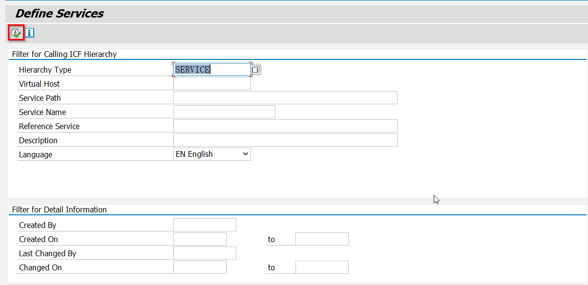
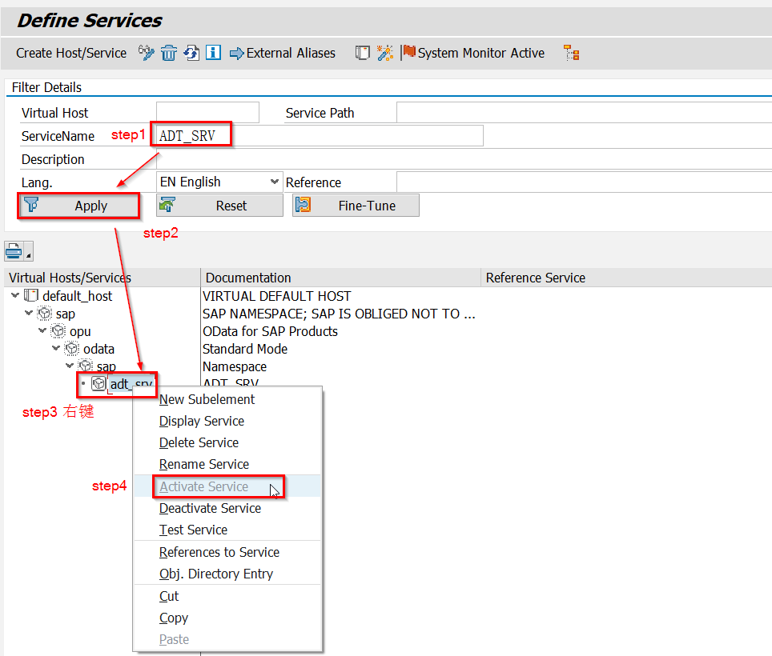
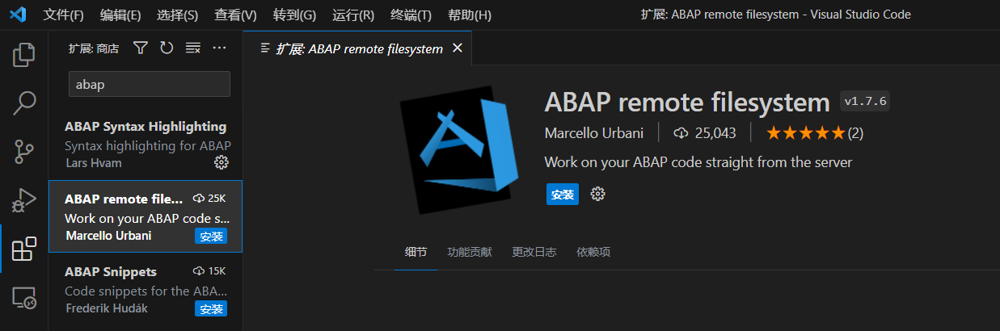
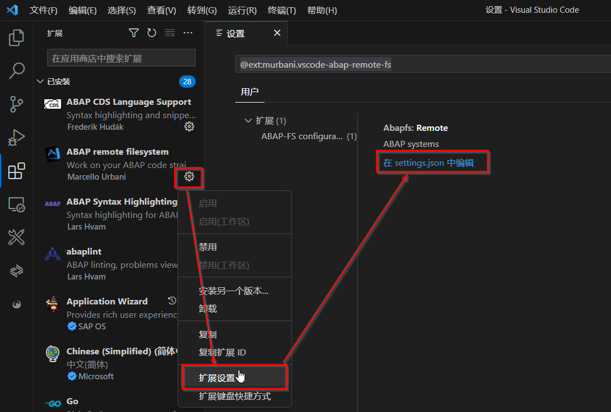

## 什么是GitHub Copilot？
> **微软与OpenAI共同推出了一款AI编程工具GitHub Copilot**

- GitHub Copilot是一个人工智能驱动的代码完成工具。它使用OpenAI的GPT(生成预训练变压器)技术来增强其建议。它可以根据您编写代码的上下文建议代码片段甚至整个函数。

- GitHub Copilot利用先进的机器学习模型，将人工智能辅助编码提升到新的高度。它的工作原理是分析来自各种开源项目的数百万行代码，并从开发人员社区的集体知识中学习。这使得Copilot能够实时生成智能代码建议和完成，帮助开发人员更快、更准确地编写代码。Copilot最令人印象深刻的功能之一是它能够根据给定的输入生成完整的代码块或功能。通过理解期望的结果，Copilot可以开发样板代码，减少手动输入的需要并加速开发过程。

- 凭借其代码完成、建议生成和代码生成功能，Copilot加快了编码速度、提高了准确性并提高了生产力。它利用对编程模式和最佳实践的深刻理解来提供明智的建议，减少了花在手工输入和代码探索上的时间。然而，在依赖副驾驶的建议和利用人类的判断和专业知识之间保持平衡是至关重要的。此外，在接下来的部分中，我们将深入研究GitHub Copilot的功能，说明Visual Studio Code中的设置过程，并探索其革命性ABAP开发的潜力，使开发人员能够更快，更准确，更有效地编写代码。

<!-- ============================================================分割线=====================================================================-->

## 环境配置
> **配置ABAP系统**
- 转到事务码SICF。

- 在Service Name中搜索ADT_SRV,右键单击“adt_srv”并单击“激活服务”。如果服务已经激活，则只有“停用”选项可见。此步骤启用允许代码编辑器和ide连接到SAP系统的服务。

- 执行上述步骤后，再次右键单击并选择“Test Service”。如果端口和主机配置正确，即可获取URL在下一步配置VScode时使用。

> **配置VScode以编写abap代码**
- 安装拓展。搜索“abap”并安装abap远程文件系统。这将把visual studio代码转换成一个IDE，在这个IDE中，ABAP开发可以直接在SAP服务器上操作。

- 配置拓展，实现远程服务。 
添加下面的代码片段。输入SAP系统标签、用户名和连接VS Code的SAP系统的密码。这将为你的系统创建一个配置文件，你可以在VS Code中连接它。例如，如果您正在连接客户机100，那么用户名和密码将是所提到的客户机的用户名和密码。通过这样做，您可以设置与SAP系统建立连接的需求。
~~~json
{
    // ABAP configuration
    "editor.formatOnSave": true,
    "[json]": {
        "editor.defaultFormatter": "esbenp.prettier-vscode"
    },
    "workbench.editorAssociations": {
        "*.ipynb": "jupyter.notebook.ipynb"
    },
    "abapfs.remote": {
        "S4H": {
            //Add SAP system label
            "url": "",
            "username": "", //Add username
            "password": "", //Add password
            "client": "",
            "language": "EN",
            "allowSelfSigned": true
        }
    },
    "[jsonc]": {
        "editor.defaultFormatter": "esbenp.prettier-vscode"
    },
    "security.workspace.trust.untrustedFiles": "open",
    "editor.inlineSuggest.enabled": true
}
~~~
