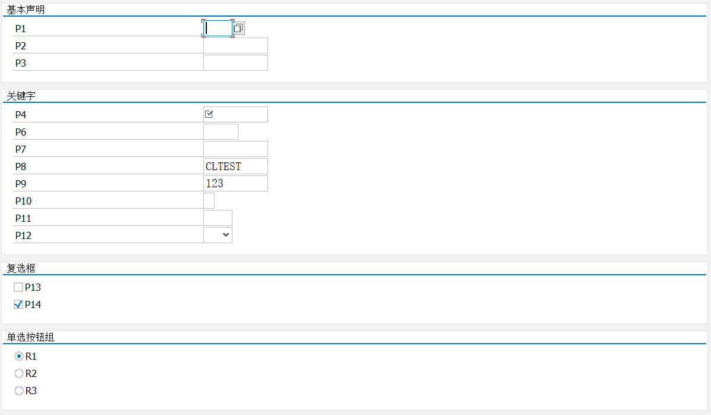
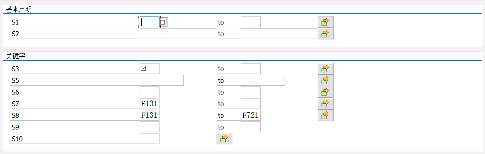
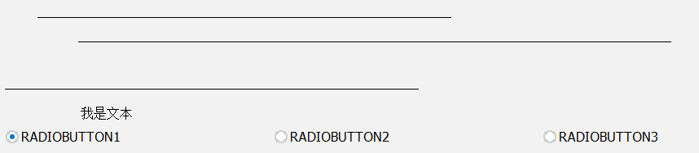
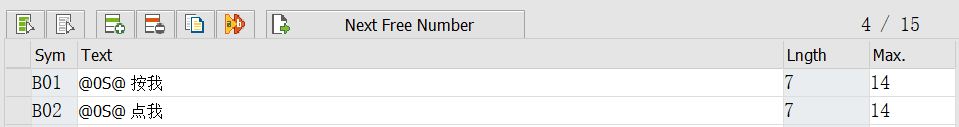
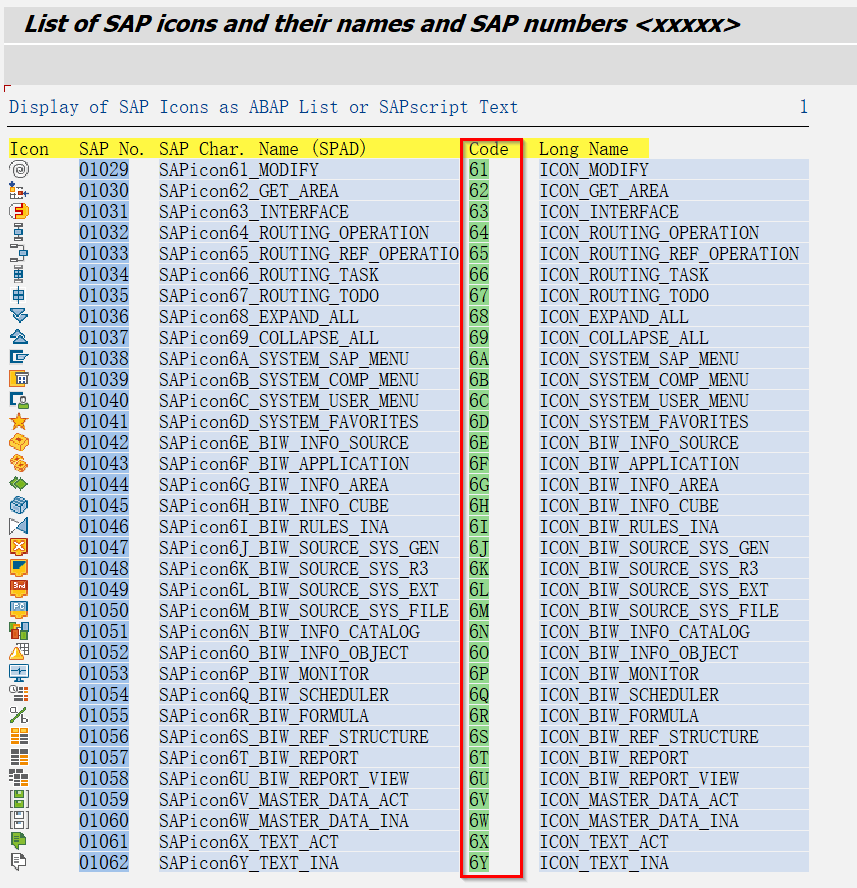
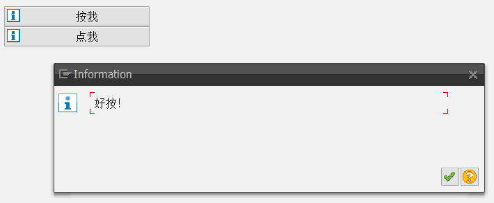
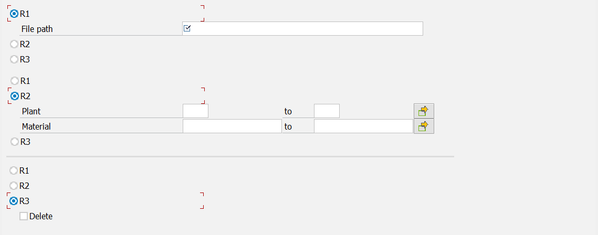
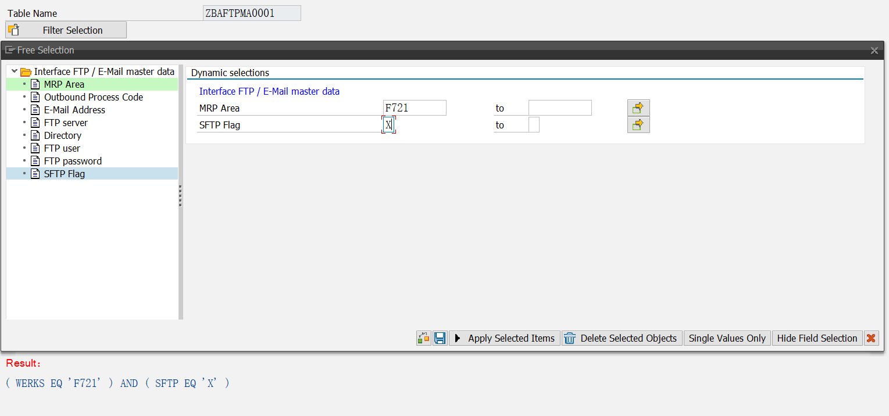

## PARAMETERS
> **代码示例**
~~~abap
TABLES marc.

"基本声明
SELECTION-SCREEN BEGIN OF BLOCK block1 WITH FRAME TITLE TEXT-h01.
  PARAMETERS: p1     LIKE marc-werks,
              p2     TYPE c LENGTH 10,
              p3(10).
SELECTION-SCREEN END OF BLOCK block1.

"关键字
SELECTION-SCREEN BEGIN OF BLOCK block2 WITH FRAME TITLE TEXT-h02.
  PARAMETERS: p4  TYPE c LENGTH 10 OBLIGATORY,                  "必输
              p5  TYPE c LENGTH 10 NO-DISPLAY,                  "不显示
              p6  TYPE c LENGTH 10 VISIBLE LENGTH 5,            "设置输入框的可见长度
              p7  TYPE c LENGTH 10 LOWER CASE,                  "区分大小写
              p8  TYPE c LENGTH 10 DEFAULT 'CLTEST',            "默认值
              p9  TYPE c LENGTH 10 MEMORY ID m1,                "内存记忆，留有上次执行过的记录
              p10 TYPE zcrcat MATCHCODE OBJECT z_crcar,         "添加搜索帮助
              p11 LIKE marc-werks VALUE CHECK,                  "根据设定的Check table进行检查
              p12 LIKE marc-werks AS LISTBOX VISIBLE LENGTH 4.  "结合INPUT HELP显示成LISTBOX
SELECTION-SCREEN END OF BLOCK block2.

"复选框
SELECTION-SCREEN BEGIN OF BLOCK block3 WITH FRAME TITLE TEXT-h03.
  PARAMETERS: p13 AS CHECKBOX,
              p14 AS CHECKBOX DEFAULT 'X'.
SELECTION-SCREEN END OF BLOCK block3.

"单选按钮组
SELECTION-SCREEN BEGIN OF BLOCK block4 WITH FRAME TITLE TEXT-h04.
  PARAMETERS: r1 RADIOBUTTON GROUP g1,
              r2 RADIOBUTTON GROUP g1,
              r3 RADIOBUTTON GROUP g1.
SELECTION-SCREEN END OF BLOCK block4.
~~~
**Result:** 

<!-- ============================================================分割线=====================================================================-->

## SELECT-OPTIONS
> **代码示例**
~~~abap
TABLES marc.

SELECTION-SCREEN BEGIN OF BLOCK block5 WITH FRAME TITLE TEXT-h05.
  "基本声明
  SELECT-OPTIONS: s1 FOR marc-werks,
                  s2 FOR marc-matnr.
SELECTION-SCREEN END OF BLOCK block5.

SELECTION-SCREEN BEGIN OF BLOCK block6 WITH FRAME TITLE TEXT-h06.
  "关键字
  SELECT-OPTIONS: s3  FOR marc-werks OBLIGATORY,                                  "必输
                  s4  FOR marc-werks NO-DISPLAY,                                  "不显示
                  s5  FOR marc-matnr VISIBLE LENGTH 10,                           "设置输入框的可见长度
                  s6  FOR marc-werks LOWER CASE,                                  "区分大小写
                  s7  FOR marc-werks DEFAULT 'F131' OPTION EQ SIGN I,             "默认值，值定义方式同RANGES
                  s8  FOR marc-werks DEFAULT 'F131' TO 'F721' OPTION BT SIGN I,   "范围默认值，值定义方式同RANGES
                  s9  FOR marc-werks NO-EXTENSION,                                "隐藏复选框
                  s10 FOR marc-werks NO INTERVALS.                                "隐藏HIGH值
SELECTION-SCREEN END OF BLOCK block6.
~~~
**Result:** 

<!-- ============================================================分割线=====================================================================-->

## SELECTION-SCREEN
> **代码示例**
~~~abap
"画线
SELECTION-SCREEN ULINE 5(50).
SELECTION-SCREEN ULINE /10(72).

"换行
SELECTION-SCREEN SKIP 2.
SELECTION-SCREEN ULINE 1(50).

"输出文本
SELECTION-SCREEN BEGIN OF LINE.
  SELECTION-SCREEN POSITION 10.
  SELECTION-SCREEN COMMENT (30) TEXT-t04.
SELECTION-SCREEN END OF LINE.

"SCREEN屏幕
SELECTION-SCREEN BEGIN OF SCREEN 2000 AS WINDOW TITLE TEXT-002.
  PARAMETERS p2 LIKE marc-werks.
SELECTION-SCREEN END OF SCREEN 2000.

CALL SELECTION-SCREEN 2000 STARTING AT 10 10 ENDING AT 80 10.

"展示到同一行
SELECTION-SCREEN BEGIN OF LINE.
  PARAMETERS r1 RADIOBUTTON GROUP g1.
  SELECTION-SCREEN COMMENT (30) TEXT-t01 FOR FIELD r1.
  PARAMETERS r2 RADIOBUTTON GROUP g1.
  SELECTION-SCREEN COMMENT (30) TEXT-t02 FOR FIELD r2.
  PARAMETERS r3 RADIOBUTTON GROUP g1.
  SELECTION-SCREEN COMMENT (30) TEXT-t03 FOR FIELD r3.
SELECTION-SCREEN END OF LINE.
~~~
**Result:** 

<!-- ============================================================分割线=====================================================================-->

## PUSHBUTTON
> **代码示例**
~~~abap
SELECTION-SCREEN PUSHBUTTON 1(20) text-b01 USER-COMMAND press.
SELECTION-SCREEN SKIP 1.
SELECTION-SCREEN PUSHBUTTON 1(20) text-b02 USER-COMMAND dot.

AT SELECTION-SCREEN.
  CASE sy-ucomm.
    WHEN 'PRESS'.
      MESSAGE i398(00) WITH '好按！'.
    WHEN 'DOT'.
      MESSAGE i398(00) WITH '好点！'.
  ENDCASE.
~~~
> 运行程序 `RSTXICON` 查看所需要的图标代码，`@图标代码@`写入text里面保存激活,在屏幕上就可以得到我们想要的图标。

**Result:** 

<!-- ============================================================分割线=====================================================================-->

## 屏幕控制
> **注意：要设置USER-COMMAND，否则MODIFY SCREEN没有效果。**

> **代码示例**
~~~abap
TABLES marc.

PARAMETERS r1 RADIOBUTTON GROUP g1 DEFAULT 'X' USER-COMMAND u1.
SELECTION-SCREEN BEGIN OF LINE.
  SELECTION-SCREEN POSITION 3.
  SELECTION-SCREEN COMMENT (30) TEXT-a01 FOR FIELD p1 MODIF ID m1.
  PARAMETERS: p1 LIKE rlgrap-filename MODIF ID m1.
SELECTION-SCREEN END   OF LINE.

PARAMETERS r2 RADIOBUTTON GROUP g1.
SELECTION-SCREEN BEGIN OF LINE.
  SELECTION-SCREEN POSITION 3.
  SELECTION-SCREEN COMMENT (27) TEXT-a02 FOR FIELD s2 MODIF ID m2.
  SELECT-OPTIONS s2 FOR marc-werks MODIF ID m2.
SELECTION-SCREEN END   OF LINE.

SELECTION-SCREEN BEGIN OF LINE.
  SELECTION-SCREEN POSITION 3.
  SELECTION-SCREEN COMMENT (27) TEXT-a03 FOR FIELD s3 MODIF ID m2.
  SELECT-OPTIONS s3 FOR marc-matnr MODIF ID m2.
SELECTION-SCREEN END   OF LINE.

PARAMETERS r3 RADIOBUTTON GROUP g1.
SELECTION-SCREEN BEGIN OF LINE.
  SELECTION-SCREEN POSITION 3.
  PARAMETERS p2 AS CHECKBOX MODIF ID m3.
  SELECTION-SCREEN COMMENT (30) TEXT-a04 FOR FIELD p2 MODIF ID m3.
SELECTION-SCREEN END   OF LINE.

AT SELECTION-SCREEN OUTPUT.
  PERFORM modify_screen.

FORM modify_screen.
  LOOP AT SCREEN.
    IF r1 = 'X'.
      IF screen-name = 'P1'.
        screen-required = '2'.  "1：真必输，有图标会检查 2：假必输，只有图标不检查。
      ENDIF.
      IF screen-group1 = 'M2' OR screen-group1 = 'M3'.
        screen-active = 0.      "隐藏radio button group
      ENDIF.

    ELSEIF r2 = 'X'.
      IF screen-group1 = 'M1' OR screen-group1 = 'M3'.
        screen-active = 0.
      ENDIF.

    ELSEIF r3 = 'X'.
      IF screen-group1 = 'M1' OR screen-group1 = 'M2'.
        screen-active = 0.
      ENDIF.
    ENDIF.
    MODIFY SCREEN.
  ENDLOOP.
ENDFORM.
~~~
**Result:** 

<!-- ============================================================分割线=====================================================================-->

## 根据内表动态生成选择条件
> **代码示例**
~~~abap
DATA: g_selection_id  TYPE rsdynsel-selid,
      g_where_clauses TYPE rsds_twhere.

PARAMETERS p_tab TYPE tabname16 OBLIGATORY.
SELECTION-SCREEN SKIP 1.
SELECTION-SCREEN PUSHBUTTON 1(20) TEXT-b03 USER-COMMAND u1.

AT SELECTION-SCREEN.
  PERFORM free_condition.

START-OF-SELECTION.
  PERFORM write_condition.

FORM free_condition .

  DATA l_msg TYPE text255.

  CASE sy-ucomm.
    WHEN 'U1'.
      PERFORM check_tables_exist.
      PERFORM init_selection.
      PERFORM fields_condition.
  ENDCASE.

ENDFORM.

FORM check_tables_exist.
  DATA: lcl_type TYPE REF TO cl_abap_typedescr.

  cl_abap_typedescr=>describe_by_name(
    EXPORTING
      p_name         = p_tab
    RECEIVING
      p_descr_ref    = lcl_type
    EXCEPTIONS
      type_not_found = 1 ).
  IF sy-subrc <> 0.
    MESSAGE s398(00) WITH |The table name { p_tab } not found in SAP| DISPLAY LIKE 'E'.
    LEAVE TO SCREEN '1000'.
  ENDIF.
ENDFORM.

FORM init_selection.

  DATA: lt_tab TYPE STANDARD TABLE OF rsdstabs.

  lt_tab = VALUE #( ( prim_tab = p_tab ) ).

  CALL FUNCTION 'FREE_SELECTIONS_INIT'
    EXPORTING
      kind                     = 'T'
    IMPORTING
      selection_id             = g_selection_id
    TABLES
      tables_tab               = lt_tab
    EXCEPTIONS
      fields_incomplete        = 1
      fields_no_join           = 2
      field_not_found          = 3
      no_tables                = 4
      table_not_found          = 5
      expression_not_supported = 6
      incorrect_expression     = 7
      illegal_kind             = 8
      area_not_found           = 9
      inconsistent_area        = 10
      kind_f_no_fields_left    = 11
      kind_f_no_fields         = 12
      too_many_fields          = 13
      dup_field                = 14
      field_no_type            = 15
      field_ill_type           = 16
      dup_event_field          = 17
      node_not_in_ldb          = 18
      area_no_field            = 19
      OTHERS                   = 20.
  IF sy-subrc <> 0.
    MESSAGE 'Error in initialization' TYPE 'S' DISPLAY LIKE 'E'.
    LEAVE TO SCREEN '1000'.
  ENDIF.
ENDFORM.

FORM fields_condition.

  DATA: where_clauses TYPE rsds_twhere,
        fields_tab    TYPE STANDARD TABLE OF rsdsfields.

  CALL FUNCTION 'FREE_SELECTIONS_DIALOG'
    EXPORTING
      selection_id    = g_selection_id
      title           = 'Free Selection'
      status          = '0'
      as_window       = 'X'
      tree_visible    = ''
    IMPORTING
      where_clauses   = g_where_clauses
    TABLES
      fields_tab      = fields_tab
    EXCEPTIONS
      internal_error  = 1
      no_action       = 2
      selid_not_found = 3
      illegal_status  = 4
      OTHERS          = 5.
  IF sy-subrc <> 0.
    MESSAGE 'Error in free selection' TYPE 'S' DISPLAY LIKE 'E'.
    LEAVE TO SCREEN '1000'.
  ENDIF.

ENDFORM.

FORM write_condition.
  DATA: l_str    TYPE string,
        l_result TYPE string.

  FIELD-SYMBOLS: <ls_tab>,
                 <fs_where> TYPE rsds_where.

  ASSIGN g_where_clauses[ tablename = p_tab ] TO <fs_where>.
  IF <fs_where> IS ASSIGNED AND <fs_where>-where_tab IS NOT INITIAL.
    LOOP AT <fs_where>-where_tab ASSIGNING <ls_tab>.
      l_str = <ls_tab>.
      IF l_result IS INITIAL.
        l_result = l_str.
      ELSE.
        l_result = |{ l_result } { l_str }|.
      ENDIF.

      CLEAR l_str.

    ENDLOOP.
  ENDIF.

  WRITE l_result.
ENDFORM.
~~~
**Result:** 
