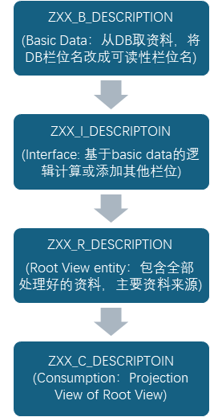

## View Entity

* 用 CDS DDL 语句 **DEFINE VIEW ENTITY** 定义的 ABAP Core Data Services Entity。
* CDS View Enity 可以用作ABAP SQL语句中的数据源或其他 CDS View Enity 的数据源。
* CDS View Enity 不能用作字典对象定义的数据类型。

## View Entity - 客制层级结构

## View Entity - Association

* **Association 和 Join的区别**：

  * 假设现在有两个CDS View：V1(物料自身的资料) & V2(物料展BOM的资料)，app画面有两个画面，Overview页面看物料的自身的资料，Detail页面看展BOM的资料。
  * V1 Join V2(Eager Join):
    * 访问Overview页面的时候会连同Detail页面的资料也一起抓取。
    * ABAP SQL 语句只SELECT V1.a V1.b 两个栏位，ST05 Trace 底层的 SQL 语句会看到V2也包含到 SQL 语句中。
  * V1 Association to V2(Lazy Join):
    * 访问Overview页面的时候不会抓取Detail页面的资料，访问Detail 的时候才会抓取。
    * ABAP SQL 语句只SELECT V1.a V1.b 两个栏位，ST05 Trace 底层的 SQL 语句只会看到SELECT V1.a V1.b FROM V1。
    * ABAP SQL 语句SELECT V1.a V1.b V2.c V2.d 四个栏位，ST05 Trace 底层的 SQL 语句只会看到SELECT V1.a V1.b V2.c V2.d  FROM V1 LEFT OUT JOIN V2。
* **ASSOCIATION  [min..max]  TO [Target]  AS _xxx ON [CONDITION]**

  * 规则：
    * Max不能为0
    * Max = * 表示匹配任意行数
    * Min不能为*
    * Min可以不填，不填默认设置为1，即association [0..1] to 等效于 association [1] to
    * 当WHERE条件中用CDS association关联的对象时，Max必须为1
    * 别名的命名规则：_xxx
* **ASSOCIATION TO PARENT [Target] AS _xxx ON $projection.[CONDITION]**

  * 定义子实体的父实体对象，必须先ASSOCIATION TO PARENT，然后才能在父实体中定义COMPOSITION。
* **COMPOSITION [min..max] OF [Target]  AS _xxx ON [CONDITION]**

  * 定义父实体的子实体对象，如果要删除关联关系，必须先删除父实体的COMPOSITION，才能删除ASSOCIATION TO PARENT。

## View Entity - Root View Entity

* 将CDS视图实体view entity定义为ABAP RESTful应用程序编程模型中RAP业务对象的根实体。根实体是业务对象层次结构的顶层节点，表示业务对象。
* 在业务对象(Buiness Object)的结构中只有一个根实体(Root View Entity)。
* Root View Entity 没有父类实体。
* Root View Entity 可以通过关键字 **COMPOSITION** 来定义业务对象的子实体(非强制性)。
* Root View Entity 可以是子leaf entity。
* 语句**EXTEND VIEW ENTITY**可以向根实体添加内容，但不能将常规视图实体转换为根实体。
