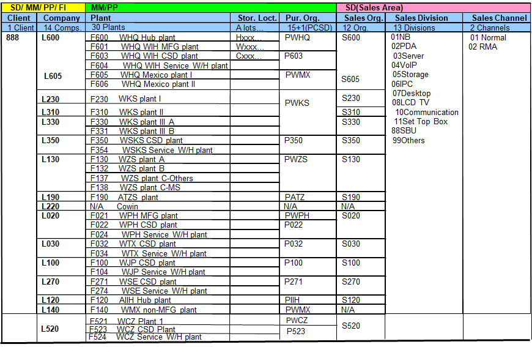
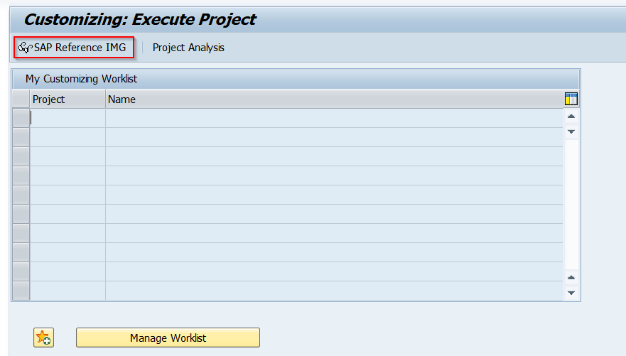
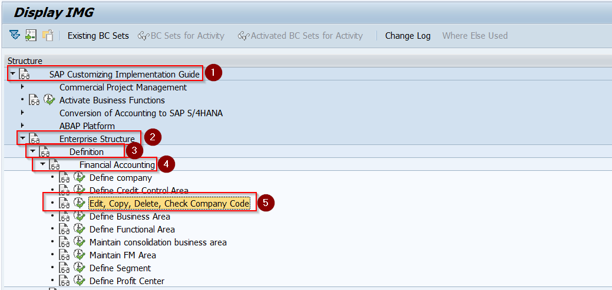
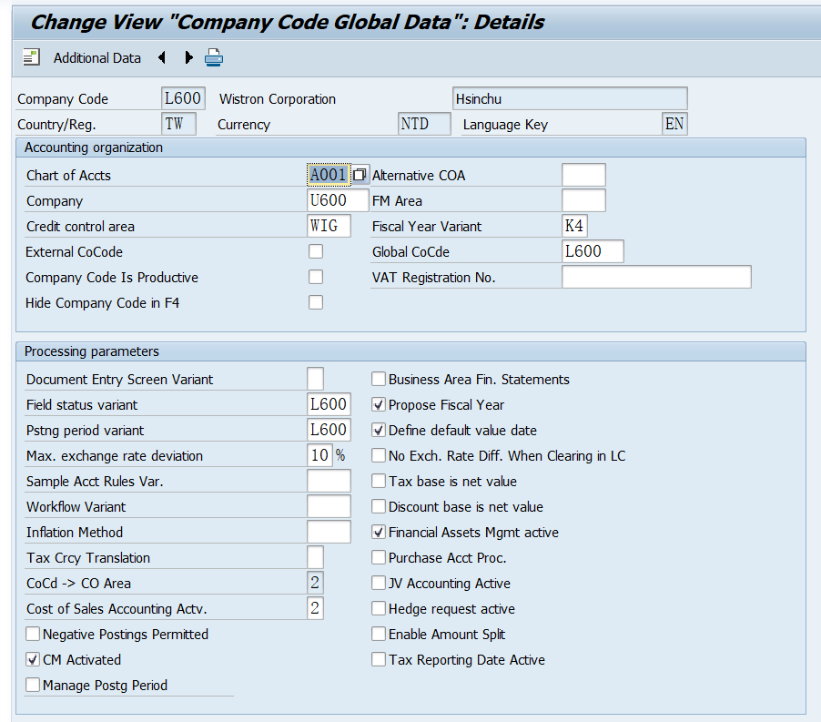
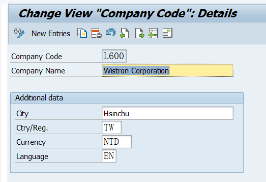
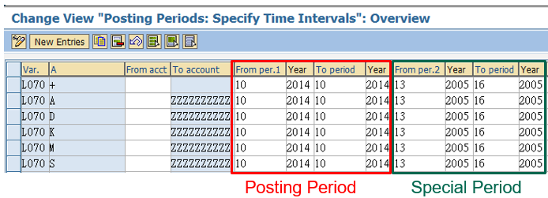
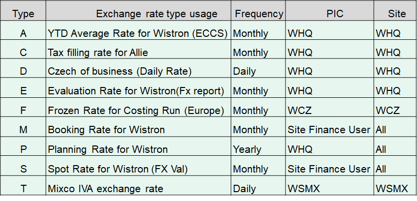
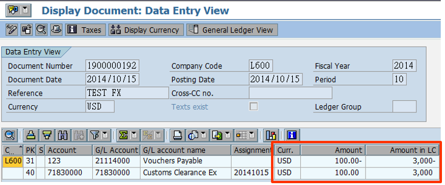
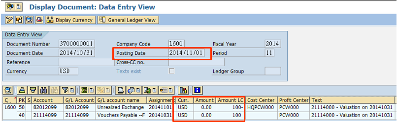
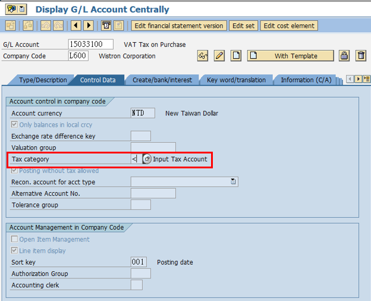

## FI- 简介

## FI - 标准表

> **主数据**

* **SKA1** : 查帐范围表（G/L Account Master (Chart of Accounts)）
* **SKB1** : 公司代码中的总帐科目（G/L Account Master (Company Code)）
* **LFA1** : 供应商主数据（Vendor Master Data）
* **LFB1** : 公司代码中的供应商主数据（Vendor Master (Company Code)）
* **KNA1** : 客户主数据（Customer Master Data）
* **KNB1** : 公司代码中的客户主数据（Customer Master (Company Code)）

> **凭证表**

* **BKPF** : 会计凭证头（Accounting Document Header）
* **BSEG** : 会计凭证明细（Accounting Document Segment）
* **ACDOCA** : 通用会计凭证表（Universal Journal Entry Line Items）
* **BSIK** : 应付账款的供应商开票（Open items for vendor accounts）
* **BSID** : 应收账款的客户开票（Open items for customer accounts）
* **BSIS** : 应收账款的总帐开票（Open items for G/L accounts）

> **资产会计**

* **ANLA** : 资产主表（Asset Master Record）
* **ANLB** : 资产到期表（Asset master record: depreciation areas）
* **ANLC** : 资产概要表（Asset values）
* **ANLC** : 资产到期表细节（Asset value fields）
* **ANEP** : 资产凭证明细（Asset Line Items）

> **应收账款和应付账款**

* **BSAK** : 已清项目- 应付账款（Cleared items for vendor accounts）
* **BSAD** : 已清项目- 应收账款（Cleared items for customer accounts）
* **KNC1** : 客户主记录中的控制特性（Customer master (transaction figures)）
* **LFC1** : 供应商主记录中的控制特性（Vendor master (transaction figures)）

> **银行会计**

* **BNKA** : 银行主记录（Bank master record）
* **LFBK** : 供应商银行关系表（Vendor master (bank details)）
* **KNBK** : 客户银行关系表（Customer master (bank details)）

> **财务控制**

* **GLT0** : 总账余额年账户字段（General Ledger Totals）
* **GLPCA** : 新总账利润中心核算（G/L PCA totals）
* **GLPCT** : 新总账利润中心表内数据（G/L PCA Totals Table）
* **COSP** : 成本总账表（CO Object: Cost Totals for Internal Costs）

> **税务和调整**

* **T007A** : 税码主数据表（Tax codes）
* **T007S** : 税价/交易类型/版本的和税表（Tax Calculation Procedures）

> **特殊用途**

* **CSKA** : 查帐范围下的成本元素（Cost Elements for Chart of Accounts）
* **CSKB** : 成本控制区域的成本元素（Cost Elements for Controlling Area）
* **T030** : GL科目和科目确定（Automatic Postings Configuration）
* **TVARV** : 条件/变量字段（Table of variables in selection criteria）

> **公司代码和配置**

* **T001** : 公司代码表（Company Codes）
* **T001K** :企业代码的时间表（Business Areas）
* **T042** : 支付方法配置表（Payments Method Configuration）

## FI 主档资料（GL/GL Master Data）

### FI - Wistron Organization Structure(SD/MM/PP/FI)

### FI - Company Code

> **概念**

**公司代码（Company Code）** ：公司代码是SAP FI模块中的一个重要概念，它是一个独立的会计单位，代表一个独立的法律实体。每个公司代码都有自己的财务报表和会计记录。

> **创建 Company code**

* Company code 是IMG设定，创建Company code一般会copy原有的Company进行修改，IMG设定T-code：SPRO

> **查看、修改Company code明细**

* T-code：OBY6、OX02

### FI - Fiscal Year & Period

> **概念**

* Fiscal Year：财政年度是一个完整的会计周期，通常为12个月，但也可以根据公司的需要进行调整。
* Period：财政年度由多个期间组成，通常为12个期间（Posting Period, 每个月一个期间），但也可以包括特殊期间（Special Periods）用于年末调整。
* Posting Period: 在此期间内允许进行财务交易的记录和过账。
* Special Period: 特殊期间是用于年末调整和结账的额外期间。通常，一个会计年度可以包含4个特殊期间，用于处理年末调整条目。
* 纬创没有用到Special Period，只是SAP有提供这个功能设定。

> **Period 设定**

* T-code: OB52

### FI - Document

> **概念**

* 在SAP FI（财务会计）模块中，财务凭证（FI Document）是用于记录和管理财务交易的基本单位。每个财务交易都会生成一个财务凭证，包含交易的详细信息，如日期、金额、科目等。
* FI Document 有以下主要组成部分：

1. **财务凭证编号（FI Document Number）**

   财务凭证是记录财务交易的基本单位。每个财务凭证都有一个唯一的凭证编号，并包含交易的详细信息。
2. **凭证类型（Document Type）**

   凭证类型用于区分不同类型的财务交易，如客户发票、供应商发票、银行交易等。每个凭证类型都有特定的编号范围和属性。
3. **凭证头（Document Header）**

   凭证头包含财务凭证的总体信息，如凭证日期、凭证类型、公司代码等。
4. **凭证行项目（Document Line Items）**

   凭证行项目包含财务凭证的详细交易信息，如科目、金额、税码等。每个财务凭证可以包含多个行项目。
5. **过账（Posting）**

   过账是指将财务凭证记录到总账中。过账后的凭证会影响公司的财务报表和账户余额。

> **FI Document 创建/修改/查看**

* T-code: FB01 / FB02 / FB03

> **FI Document Type**

* T-code: OBA7
* 凭证类型（Document Type）是用于区分不同类型财务交易的关键配置。凭证类型定义了财务凭证的编号范围、过账规则和其他属性。

> **FI Document Range**

* T-code: FBN1
* 凭证编号范围（Document Number Range）用于定义财务凭证的编号规则。每个凭证类型都有一个唯一的编号范围，用于生成财务凭证的编号。

> **FI Document Posting Key**

* T-code: OB41
* 过账码（Posting Key）是用于定义财务凭证行项目的过账规则和属性的关键配置。过账码决定了行项目是借方还是贷方、允许的科目类型、是否需要输入金额等。
* 常见的SAP FI过账码及其用途:

| Posting Key | 用途               |
| ----------- | ------------------ |
| 40          | 借方过账到总账科目 |
| 50          | 贷方过账到总账科目 |
| 01          | 借方过账到客户     |
| 11          | 贷方过账到客户     |
| 21          | 借方过账到供应商   |
| 31          | 贷方过账到供应商   |
| 70          | 借方过账到资产     |
| 75          | 贷方过账到资产     |

* Account Types:

| 账户类型 | 描述               | Description                          |
| -------- | ------------------ | :----------------------------------- |
| +        | 对所有帐户类型有效 | Valid for all account types          |
| A        | 资产               | Assets                               |
| D        | 客户               | Customers（Accounts Receivable，AR） |
| K        | 供应商             | Vendors（Accounts Payable，AP）      |
| M        | 物料               | Materials                            |
| S        | 总账科目           | G/L accounts                         |
| V        | 合同账户           | Contract accounts                    |

### FI - Exchange Rate

> **概念**

汇率（Exchange Rate）用于将不同货币之间的金额进行转换。汇率的管理对于处理跨国交易和生成准确的财务报表至关重要。

> **Exchange Rate Type in Wistron**

> **Exchange Rate设定**

* T-code: OB08

> **Exchange Rate List**

* T-code: ZFIQ02

### FI - Foreign Currency Valuation

> **概念**

外币评估（Foreign Currency Valuation）是用于重新评估以外币表示的资产和负债，以反映当前汇率的变化。外币评估的目的是确保财务报表中的外币项目以最新的汇率进行反映，从而提供准确的财务状况。

> **例子**

假设在月初，我们用M rate（Booking rate）USD:NTD = 1:30来开具发票。

M rate是指在未来某个日期（Posting Date）进行货币换算时预先设定好的汇率。

到了该结算上面这张发票的时候，S Rate和 当初使用的 M rate不一样，USD:NTD = 1:31。

S rate是指在当前市场条件下，立即进行货币兑换的汇率，即实时汇率。

这时就需要执行T-code: FAGL_FCV 来重新评估FI Document。此时会产生一张新的FI Document，这样可以确保财务报表中的外币项目以最新的汇率进行反映，从而提供准确的财务状况和报告。

### FI - Chart of account

> **概念**

科目表是（Chart of Accounts，COA）总账科目（G/L Account）的集合，用于定义公司代码的财务结构。每个科目表都有一个唯一的标识符和描述。可用于定义G/L Account的长度。

* T-code: OB13

### FI - G/L Account Master

> **概念**

总账科目主数据（G/L Account Master Data）是用于记录和管理财务交易的基础数据。总账科目主数据包含了总账科目的详细信息，如科目编号、科目描述、科目类型等。

* T-code: FSP3/FS03

> **Tax category**

| 类型 | 描述                     | 功能                                                                                                   |
| ---- | ------------------------ | ------------------------------------------------------------------------------------------------------ |
| -    | Only input tax allowed   | 将总账定义为普通账。 只允许在会计凭证中输入进项税号。                                             |
| +    | Only output tax allowed | 将总账定义为普通账。 只允许在会计凭证中输入输出税号。                                             |
| *    | All tax types allowed    | 将总账定义为普通账。 没有检查和限制，允许任何税号。                                               |
| >    | Input Tax Account        | 定义总账到税总账，税号是必需的。 只允许输入税号和税额，在创建会计凭证时还需要输入税基金额和税额。 |
| <    | Output Tax Account       | 定义总账到税总账，税号是必需的。 只允许输出税号，在创建会计凭证时也需要输入税基金额和税额。       |
| null |                          | 没有税务信息。                                                                                         |

### FI - G/L Account item

* T-code: FBL3N
