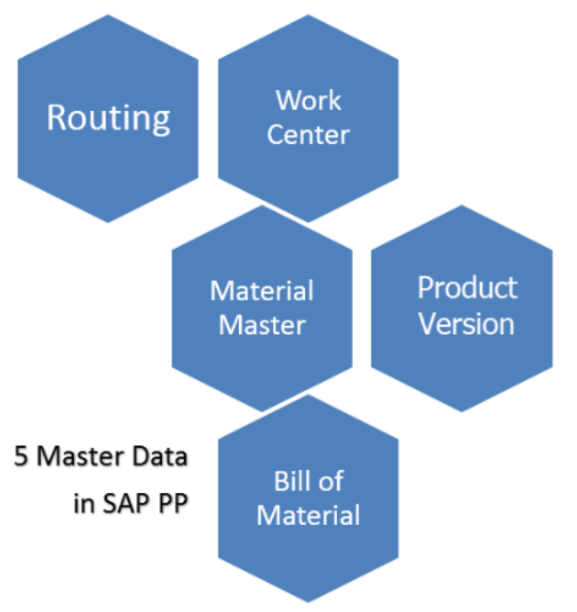
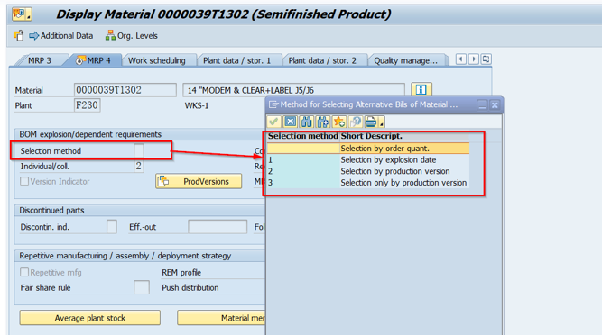
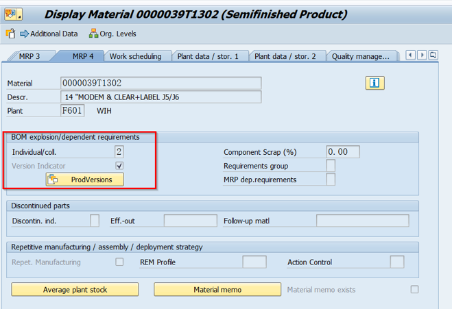
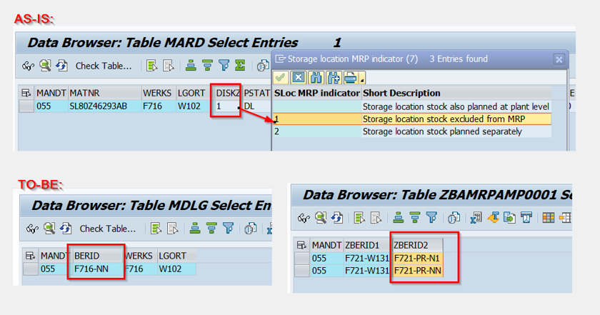

## PP - 简介

- PP全称Production Planning，生产计划。
- 生产计划是将需求与制造能力结合起来，为成品和部件材料制定生产和采购计划的过程。
- SAP PP是SAP的一个重要模块，它对制造过程流程进行跟踪和记录，例如计划成本和实际成本。还有，货物从原材料到半成品的转换过程。
- 它与其他SAP模块:SD, MM, QM, FICO和PM关系密切。

<!-- ============================================================分割线=====================================================================-->

## PP - 标准表

> **生产订单（Production Orders）**

* **AFKO** : 生产订单头（Order Header Data PP Orders）
* **AFPO** : 生产订单项目（Order Item）
* **AFVC** : 订单操作（Order Operation）
* **AFVV** : 订单操作值（Order Item Values）
* **AUFK** : 订单主数据（Order Master Data）
* **COBK** : 订单凭证头（Order Document Header）
* **COEP** : 订单凭证明细行（CO Object: Line Items (by Period)）

> **生产工艺路线（Routings）**

* **PLKO** : 任务列表头（Task List Header）
* **PLPO** : 任务列表操作（Task List Operation/Activity）
* **PLAS** : 任务列表分配（Allocation of Task Lists to Work Center）
* **MAPL** : 物料分配到任务列表（Allocation of Task Lists to Materials）

> **物料清单（Bill of Materials, BOM）**

* **STKO** : BOM头（BOM Header）
* **STPO** : BOM项目（BOM Item）
* **STAS** : BOM分配（BOM Allocation to Plant）
* **MAST** : 物料与BOM主记录（Material to BOM Link）

> **工作中心（Work Centers）**

* **CRHD** : 工作中心头（Work Center Header）
* **CRCO** : 工作中心内的已分配成本中心（Assignment of Cost Centers to Work Center）
* **CRA1** : 标准值转换（Standard Value Key Conversion）
* **KAKO** : 能力需求记录头（Capacity Requirements Records Header）
* **KAPA** : 能力需求记录（Capacity Requirements Records）

> **计划 (Planning)**

* **PBED** : 独立需求（Independent Requirements Data）
* **PBIM** : 独立需求行项目（Independent Requirements Item）
* **MDFD** : 物料需求规划的运营数据（Material Requirements Planning Operation Data）
* **MDKP** : MRP记录（Header Data for MRP Document）
* **MDTB** : MRP计划表（Tables and Indexes for MRP Planning）

> **需求管理 (Requirements Management)**

* **RESB** : 需求/订单的物料需求（Reservation/Dependent Requirements）
* **AFRU** : 订单确认（Order Confirmations）
* **AFFW** : 订单确认货物移动（Goods Movements with Reference to Order Confirmation）

> **计划订单 (Planned Orders)**

* **PLAF** : 计划订单（Planned Order Data）

> **确认 (Confirmations)**

* **AFRU** : 订单确认（Order Confirmations）
* **AFFW** : 确认的货物移动（Goods Movements with Reference to Order Confirmation）
* **AFRC** : 确认细项（Confirmation of Order Process）

> **批次管理（Batch Management）**

* **MCHA** : 批次（Batch Data）
* **MCHB** : 批次库存（Batch Stocks）

> **库存控制（Inventory Control）**

* **MMIM** : 库存管理模块集成表（Inventory Management Integration Table）
* **MKPF** : 物料凭证头（Material Document Header）
* **MSEG** : 物料凭证明细（Material Document Item）
* **MBEW** : 物料评估（Material Valuation）

> **成本控制（Cost Control）**

* **COSR** : 成本控制汇总（Cost Object: Summarization Data）
* **COSS** : 成本总计（Cost Totals for Internal Orders）

> **计划订单变更 (Change Planning Orders)**

* **PLKO** : 路线计划单订单头(Operational Task Instructions Header)
* **PLPO** : 路线计划单订单操作(Operational Task Instructions items)
* **AFVC** : 计划订单操作(Order operations)

## PP - 组织结构

- 在任何实时生产计划模块中，制造工厂的位置和工厂内的仓库应该在系统中可用。
- 工厂和仓库在生产计划中的要点：
  1. 所有生产主数据都是在工厂级别创建的。
  2. 计划活动也在工厂层面进行。
  3. 生产确认流程和相关的货物流动在工厂和仓库层面进行。

<!-- ============================================================分割线=====================================================================-->

## PP - 主数据

- 对于任何公司来说，主数据通常是静态的，很少根据需求进行更改。在生产计划模块中有5个主数据需要维护。
  

<!-- ============================================================分割线=====================================================================-->

## PP - 物料主档

- 物料主档包含公司采购、生产、储存和销售的所有材料的信息。一个物料主档记录有唯一的数字标识，对应一个物料。
- 具有相同基本属性的物料会被分组在一起，并分配到不同的物料类型，如成品，原料等。
- 物料主档作用如下：
  1. 采购材料。
  2. 用于库存管理中的货物发放或收货等货物移动记录，也用于实物库存记录。
  3. 在发票审核中用于开发票。
  4. 在销售和分销过程中完成销售订单。
  5. 在生产计划和控制中对物料需求进行计划、排程和生产确认过程。

<!-- ============================================================分割线=====================================================================-->

## PP - 物料清单（BOM）

- 物料清单是一份完整的、正式的结构清单，列出了生产产品或装配所需的部件数量。
- 物料清单用于物料需求计划和产品成本计算。
- 您还可以为单个产品创建多达99个可选择的物料清单。
- 对于具有变体的产品，您可以创建超级BOM，其中包含用于制造不同类型变体的所有可能类型的组件，并根据销售订单中选择的特性选择适当的组件。
- 例如，产品周期可以包含所有类型的框架(具有不同的颜色和尺寸)，并且根据销售订单中选择的颜色和尺寸在生产订单中选择所需的框架。

<!-- ============================================================分割线=====================================================================-->

## PP - None-Nettable

- "None-Nettable" 是一个供应链管理和物料需求计划（MRP）领域的术语。在MRP系统中，物料通常被标记为可以或不可以参与净计算（Netting）。
- 当物料被标记为 "None-Nettable" 时，意味着该物料不参与净计算过程。净计算是指在物料需求计划的过程中，根据销售订单、预测需求、库存水平等因素，计算出实际需要采购或生产的物料数量。
- 标记为 "None-Nettable" 的物料通常是指那些不直接用于最终产品的辅助物料或资源，或者是不对应特定库存的虚拟物料。例如，生产流程中的能源消耗、劳动力成本等可能被标记为 "None-Nettable"。
- 通过将物料标记为 "None-Nettable"，系统可以排除这些物料对MRP计算和需求传导的影响，从而更准确地计算和处理实际需求和库存。
- 需要注意的是，具体的标记方式和术语可能会因不同的供应链管理系统而有所不同。因此，在具体的系统中，可能会使用其他类似的术语来表示 "None-Nettable" 物料。

<!-- ============================================================分割线=====================================================================-->

## PP - work center

- 工作中心是执行生产操作的一台或一组机器。工作中心用于任务列表操作(路由)。
- 工作中心包含以下资料：
  1. Scheduling 调度
  2. Capacity 能力
  3. Costing 成本核算

<!-- ============================================================分割线=====================================================================-->

## PP - routing

- 路由只不过是在工作中心执行的一系列操作。它还规定了执行操作的机器时间、劳动时间等。
- 路由还用于作业调度和用于产品的标准成本计算。

## PP - Production Version

> **Selection method**

选择方法决定了在BOM展开过程中应该使用哪个BOM。这对于确定生产过程中所需的物料和数量至关重要。选择方法可以帮助系统在有多个BOM可用时确定应该使用哪一个。

> **R/3**

可以自行选择不同的Selection method。

> **S/4**

只能选择依据生产版本。使用BDC进行料号配置时需要先创建好生产版本，否则会流程无法顺利进行。

## PP - MRP Area

> **解释**

在SAP中，MRP区域（Material Requirements Planning Area）是用于物料需求计划的组织单位。它定义了在进行物料需求计划时应考虑的特定区域。

MRP区域可以是以下几种类型：

1. 工厂MRP区域：这是默认的MRP区域，代表整个工厂。在这种情况下，整个工厂被视为一个单一的MRP区域，所有的物料需求计划都在这个区域内进行。
2. 存储地点MRP区域：这种类型的MRP区域代表工厂内的一个特定存储地点。在这种情况下，每个存储地点都被视为一个独立的MRP区域，物料需求计划在每个存储地点内单独进行。
3. 生产线MRP区域：这种类型的MRP区域代表工厂内的一个特定生产线。在这种情况下，每个生产线都被视为一个独立的MRP区域，物料需求计划在每个生产线内单独进行。

MRP区域的使用可以提高物料需求计划的灵活性和精度。通过在更小的区域内进行物料需求计划，企业可以更准确地预测物料需求，更有效地管理库存，并更好地满足客户需求。

> **R/3**

在SAP R/3中，MRP区域主要用于代表工厂内的一个特定区域，如存储地点或生产线。然而，它的应用相对有限，主要用于特定的业务场景，如跨工厂的物料需求计划。

> **S/4**

在SAP S/4HANA中，MRP区域的概念得到了扩展。现在，MRP区域可以代表工厂的任何部分，包括存储地点、生产线、供应链节点等。此外，SAP S/4HANA还支持跨公司代码的MRP区域，这使得在更复杂的供应链环境中进行物料需求计划成为可能。

此外，SAP S/4HANA还引入了新的MRP过程，如MRP实时运行和MRP on HANA。这些新的过程利用了HANA数据库的高性能，使得物料需求计划可以在更短的时间内完成，同时提供更准确的结果。

总的来说，虽然SAP R/3和SAP S/4HANA都支持MRP区域，但SAP S/4HANA提供了更强大和灵活的MRP区域功能，以满足更复杂和动态的业务需求。

> **CDS view：zba_ddl_t001l01-diskz (1：non-nettbale ''：nettable)**

当MRP Area的后缀为‘NN’或者MRP Area存在于Table ZBAMRPAMP0001中，并且ZBERID2 不为空时，相同的Plant 以及相同location的Material都属于是non-nettable的资料。
