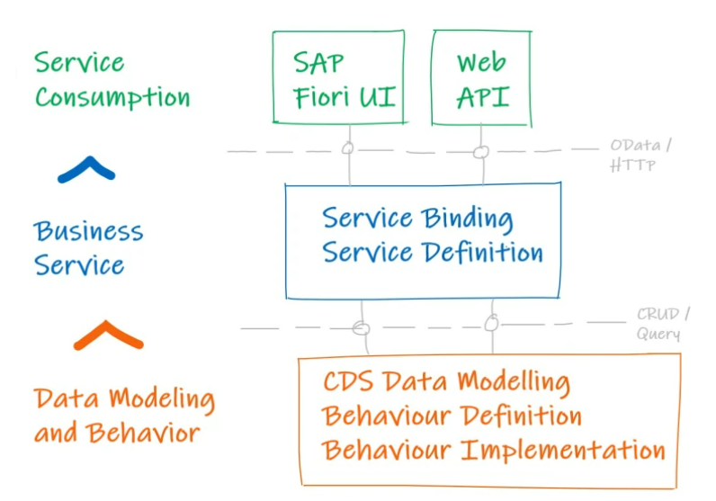

## RAP 简介

* RAP 全称：ABAP RESTful Application Programming Model
* RAP 是一种架构，用于为 SAP Fiori 应用程序或 Web API 开发 SAP HANA 优化的 OData 服务。
* 它可用于 SAP BTP ABAP 环境、SAP S/4 HANA Cloud 和 Application Server ABAP 7.56 等产品。
* 它基于基于 CDS 和 ABAP 的自定义逻辑，并使用 SAPUI5 作为用户界面。

## RAP 模型层级功能

* RAP 模型有 3 层：

  1. Data Modelling and Behavior - 数据建模和行为

     * 创建表：数据模型是业务场景中涉及的不同实体的集合，例如航空公司、航班路线和航班时刻表，以及它们之间的关系，例如航空公司和航班时刻表之间的父子关系。
     * 创建根和投影/消费 CDS 实体：RAP 使用 CDS 来定义和组织数据模型。
     * 创建元数据扩展：该行为描述可对数据模型执行哪些操作，例如，是否可以创建、更新或删除数据。
     * 创建行为定义：可以使用 ABAP 实现该行为。
  2. Buiness Service - 商业服务

     * 创建服务定义：Service Definition 用于定义 CDS / Behavior 定义的哪一部分将暴露给下一层。
     * 创建服务绑定：服务绑定定义特定的通信协议，例如 OData V2 / OData V4。
  3. Service Consumption - 消费服务

     * 创建 FIORI Element 应用程序。
* RAP 架构图：

  

    

## RAP 业务对象(RAP BO)

* RAP业务对象（RAP BO）是一种业务对象（BO），它通过支持对ABAP CDS所描述的数据的事务性访问，在ABAP RAP中起着中心作用。业务对象不是存储库对象，但它由以下组件及其关系组成—CDS行为定义在将各个组件组合在一起方面起着中心作用。
* 数据模型(Data Model)
  * 业务对象的数据建模使用构建CDS树状结构进行，该树状结构是使用CDS组合(**composition**)和父级关联(**parent**)定义的。这种类型的树状层次结构的组件如下：
  * **Root entity**: 每个业务对象只有一个根实体。根实体是CDS视图、CDS自定义实体或使用添加root定义的CDS抽象实体。根实体表示业务对象。根实体可以有一个或多个子实体，但不能有父实体。
  * **Child entity**: CDS组合可用于为业务对象的每个CDS实体定义一个或多个子实体。在将CDS实体定义为子实体之前，它必须包含与父实体之间的父关联并公开它。
  * **Parent entity**: 使用CDS组合定义子实体的业务对象的CDS实体是它们的父实体。每个子实体只能有一个父实体，语法通过在每个子实体中定义和公开一个到父实体的关联来保证这一点。
  * **Leaf entity**: 业务对象的非父实体或没有使用CDS组合定义子实体的CDS实体是叶子实体。

## RAP 行为 (Behavior)

* RAP业务对象行为在CDS Behavior Definition(BDEF)中定义。BDEF定义了RAP BO的主要特征，以及它提供了CRUD(增删改查)中的哪些操作或其他操作。有两种类型的RAP BO，托管和非托管：
  * **托管RAP BO(managed)**: 其行为完全或部分由托管RAP BO提供者提供。
  * **非托管RAP BO(unmanaged)**: 其行为必须完全由ABAP行为实现提供。
* RAP CDS Behavior Definition 以内表或结构作为参数，来定义业务对象中消费者和供给者的交互方式。
  * **RAP BO Provider(供给者)**: 以BDEF中定义的参数来实现METHOD，供消费者使用。
  * **RAP BO Consumer(消费者)**: 通过METHOD发送或接受资料。
