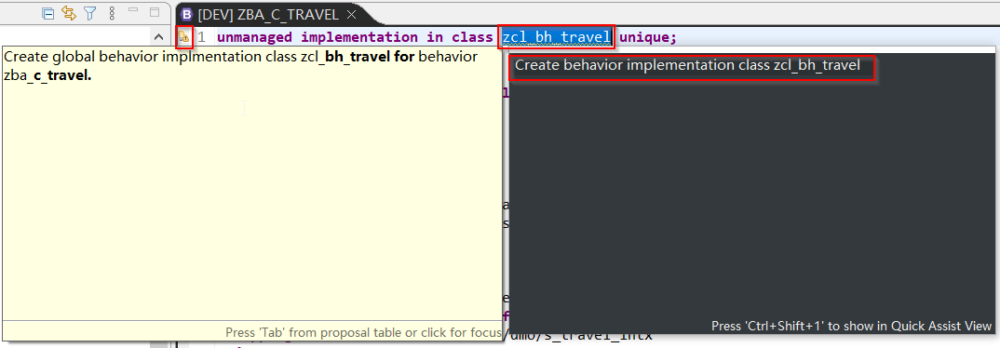

## 1. 下载SAP官方示例文件和数据（DEV055已有资料）

> **1.1 注意系统ABAP版本下载对应的示例文件**


> **1.2 请按照Github步骤安装*ABAP Flight Reference Scenario*([链接](https://github.com/SAP-samples/abap-platform-refscen-flight))**

> **1.3 abapGit的步骤完成后使用eclipse或其他ADT打开 /DMO/CL_FLIGHT_DATA_GENERATOR，然后Run as Console Application以获取测试资料**

## 2. 创建CDS View

> **2.1 创建ZBA_C_TRAVEL**


```abap
@AccessControl.authorizationCheck: #NOT_REQUIRED
@EndUserText.label: 'Entity for Booking'
@Metadata.allowExtensions: true
define view entity ZBA_C_BOOK
  as select from /dmo/booking as Booking
  association        to parent ZBA_C_TRAVEL as _Travel     on  $projection.TravelID = _Travel.TravelId
  association [1..1] to /DMO/I_Customer     as _Customer   on  $projection.CustomerID = _Customer.CustomerID
  association [1..1] to /DMO/I_Carrier      as _Carrier    on  $projection.AirlineID = _Carrier.AirlineID
  association [1..1] to /DMO/I_Connection   as _Connection on  $projection.AirlineID    = _Connection.AirlineID
                                                           and $projection.ConnectionID = _Connection.ConnectionID
{
  key Booking.travel_id     as TravelID,
  key Booking.booking_id    as BookingID,
      Booking.booking_date  as BookingDate,
      Booking.customer_id   as CustomerID,
      Booking.carrier_id    as AirlineID,
      Booking.connection_id as ConnectionID,
      Booking.flight_date   as FlightDate,
      @Semantics.amount.currencyCode: 'CurrencyCode'
      Booking.flight_price  as FlightPrice,
      Booking.currency_code as CurrencyCode,
      _Travel,
      _Customer,
      _Carrier,
      _Connection
}

```

> **2.2 创建ZBA_C_BOOK**


```abap
@AccessControl.authorizationCheck: #NOT_REQUIRED
@EndUserText.label: 'Entity for Traveling'
@Metadata.allowExtensions: true
define root view entity ZBA_C_TRAVEL
  as select from /dmo/travel as Travel
  composition [0..*] of ZBA_C_BOOK      as _Booking
  association [0..1] to /DMO/I_Agency   as _Agency   on $projection.AgencyId = _Agency.AgencyID
  association [0..1] to /DMO/I_Customer as _Customer on $projection.CustomerId = _Customer.CustomerID
  association [0..1] to I_Currency      as _Currency on $projection.CurrencyCode = _Currency.Currency
{
  key Travel.travel_id     as TravelId,
      Travel.agency_id     as AgencyId,
      Travel.customer_id   as CustomerId,
      Travel.begin_date    as BeginDate,
      Travel.end_date      as EndDate,
      @Semantics.amount.currencyCode: 'CurrencyCode'
      Travel.booking_fee   as BookingFee,
      @Semantics.amount.currencyCode: 'CurrencyCode'
      Travel.total_price   as TotalPrice,
      Travel.currency_code as CurrencyCode,
      Travel.description   as Description,
      Travel.status        as Status,
      Travel.lastchangedat as LastChangedAt,
      _Booking,
      _Agency,
      _Customer,
      _Currency
}

```

## 3. 创建Metadata Extension

> **3.1 创建Metadata extension for CDS View：ZBA_C_TRAVEL**

```abap
@Metadata.layer: #CUSTOMER
@UI:{ headerInfo: {
    typeName: 'Travel',
    typeNamePlural: 'Travels',
    title: {
        type: #STANDARD,
        value: 'TravelID'
    }
} }
annotate entity ZBA_C_TRAVEL with
{
  @UI.facet: [{
      id: 'Travel',
      purpose: #STANDARD,
      position: 10,
      label: 'Travel',
      type: #IDENTIFICATION_REFERENCE
  },{

      id: 'Booking',
      purpose: #STANDARD,
      position: 20,
      label: 'Booking',
      type: #LINEITEM_REFERENCE,
      targetElement: '_Booking'
  }]

  @UI:{ lineItem: [{position: 10,importance: #HIGH }],
           identification: [{position: 10 }],
           selectionField: [{position: 10 }] }
  TravelId;

  @UI:{ lineItem: [{position: 20,importance: #HIGH }],
        identification: [{position: 20 }],selectionField: [{position: 20 }] }
  @Consumption.valueHelpDefinition: [{

          entity: {
              name: '/DMO/I_Agency',
              element: 'AgencyID'
          }}]
  @Search.defaultSearchElement: true
  AgencyId;

  @UI:{ lineItem: [{position: 30,importance: #HIGH }],
         identification: [{position: 30 }],selectionField: [{position: 30 }] }
  @Consumption.valueHelpDefinition: [{

               entity: {
                   name: '/DMO/I_Customer',
                   element: 'CustomerID'
               }}]
  @Search.defaultSearchElement: true
  CustomerId;

  @UI:{ lineItem: [{position: 40,importance: #MEDIUM }],
       identification: [{position: 40 }] }
  BeginDate;

  @UI:{ lineItem: [{position: 41,importance: #MEDIUM }],
     identification: [{position: 41 }] }
  EndDate;

  @UI.identification: [{position: 42 }]
  BookingFee;

  @UI.identification: [{position: 43 }]
  @Consumption.valueHelpDefinition: [{
             entity: {
                 name: 'I_Currency',
                 element: 'Currency'
             }}]
  @Search.defaultSearchElement: true
  TotalPrice;

  @UI.identification: [{position: 44 }]
  Description;

  @UI.lineItem: [{position: 50,importance: #HIGH },
                             { type: #FOR_ACTION,
                               dataAction: 'set_status_booked' ,
                               label: 'Set to Booked'}]
  Status;

}
```

> **3.2 创建Metadata extension for CDS View：ZBA_C_BOOK**

```abap
@Metadata.layer: #CUSTOMER
@UI.headerInfo: {
    typeName: 'Booking',
    typeNamePlural: 'Bookings',
    title: {
        type: #STANDARD,
        label: 'Booking',
        value: 'BookingID'
    }
}
annotate entity ZBA_C_BOOK with
{
  @UI.facet: [{id: 'Booking',
                 purpose: #STANDARD,
                 type: #IDENTIFICATION_REFERENCE,
                 label: 'Booking',
                 position: 10 }]

  @Search.defaultSearchElement: true
  TravelID;

  @UI:{lineItem: [{  position: 10,importance: #HIGH }],
                identification: [{position: 10 }]
  }
  @Search.defaultSearchElement: true
  BookingID;

  @UI:{lineItem: [{position: 20,importance: #HIGH }],
        identification: [{position: 20 }]
  }
  BookingDate;

  @UI:{lineItem: [{position: 30,importance: #HIGH }],
      identification: [{position: 30 }]
  }
  @Consumption.valueHelpDefinition: [{

          entity: {
              name: '/DMO/I_Customer',
              element: 'CustomerID'
          }}]
  @Search.defaultSearchElement: true
  CustomerID;

  @UI:{lineItem: [{position: 40,importance: #HIGH }],
       identification: [{position: 40 }]
  }
  @Consumption.valueHelpDefinition: [{

         entity: {
             name: '/DMO/I_Carrier',
             element: 'AirlineID'
         }}]
  @Search.defaultSearchElement: true
  AirlineID;

  @UI:{lineItem: [{position: 50,importance: #HIGH }],
        identification: [{position: 50 }]
  }
  @Consumption.valueHelpDefinition: [{
          entity: {
              name: '/DMO/I_Flight',
              element: 'ConnectionID'
          },
          additionalBinding: [
              {localElement: 'FlightDate', element: 'FlightDate'},
              {localElement: 'AirlineID',element: 'AirlineID' },
              {localElement: 'FlightPrice',element: 'Price'},
              {localElement: 'CurrencyCode',element: 'CurrencyCode'}]
      }]
  ConnectionID;

  @UI:{lineItem: [{position: 60,importance: #HIGH }],
      identification: [{position: 60 }]
  }
  @Consumption.valueHelpDefinition: [{
          entity: {
              name: '/DMO/I_Flight',
              element: 'FlightDate'
          },
          additionalBinding: [
              {localElement: 'ConnectionID', element: 'ConnectionID'},
              {localElement: 'AirlineID',element: 'AirlineID' },
              {localElement: 'FlightPrice',element: 'Price'},
              {localElement: 'CurrencyCode',element: 'CurrencyCode'}]
      }]
  FlightDate;

  @UI:{lineItem: [{position: 70,importance: #HIGH }],
      identification: [{position: 70 }]
  }
  FlightPrice;

  @Consumption.valueHelpDefinition: [{
         entity: {
             name: 'I_Currency',
             element: 'Currency'
         }}]

  CurrencyCode;
}
```

## 4. 创建Behavior

> **4.1 为CDS View ZBA_C_TRAVEL 和 ZBA_C_BOOK创建 Behavior**

```abap
unmanaged implementation in class zcl_bh_travel unique;
//strict;

define behavior for ZBA_C_TRAVEL alias Travel
//late numbering
lock master
//authorization master(global)
etag master LastChangedAt
{
  field ( readonly ) TravelID, TotalPrice;
  field ( mandatory ) AgencyID, CustomerID, BeginDate, EndDate;
  create;
  update;
  delete;
  action ( features : instance ) set_status_booked result [1] $self;
  association _Booking { create ( features : instance ); }
  mapping for /dmo/travel control /dmo/s_travel_intx
  {
    AgencyID = agency_id;
    BeginDate = begin_date;
    BookingFee = booking_fee;
    CurrencyCode = currency_code;
    CustomerID = customer_id;
    EndDate = end_date;
    Status = status;
    TotalPrice = total_price;
    Description = description;
    TravelID = travel_id;
  }
}

define behavior for ZBA_C_BOOK alias Booking
implementation in class zcl_bh_book unique
//late numbering
lock dependent by _Travel
//authorization dependent by _Travel
etag dependent by _Travel
{
  field ( readonly ) TravelID, BookingID;
  field ( mandatory ) BookingDate, CustomerID, AirlineID, ConnectionID, FlightDate;
  update;
  delete;
  association _Travel;
  mapping for /dmo/booking control /dmo/s_booking_intx
  {
    BookingID = booking_id;
    AirlineID = carrier_id;
    BookingDate = booking_date;
    ConnectionID = connection_id;
    CurrencyCode = currency_code;
    CustomerID = customer_id;
    FlightDate = flight_date;
    FlightPrice = flight_price;
    TravelID = travel_id;
  }
}
```

## 5. 创建Class

> **5.1 为非托管场景创建Class，以便实现客制逻辑。使用ADT工具直接生成Class，生成的Class带有定义好的Method。此时的class是个空壳，客制逻辑代码后续补充。**



```abap
CLASS lhc_travel DEFINITION INHERITING FROM cl_abap_behavior_handler.
  PRIVATE SECTION.

    METHODS get_instance_features FOR INSTANCE FEATURES
      IMPORTING keys REQUEST requested_features FOR travel RESULT result.

    METHODS create FOR MODIFY
      IMPORTING entities FOR CREATE travel.

    METHODS update FOR MODIFY
      IMPORTING entities FOR UPDATE travel.

    METHODS delete FOR MODIFY
      IMPORTING keys FOR DELETE travel.

    METHODS read FOR READ
      IMPORTING keys FOR READ travel RESULT result.

    METHODS lock FOR LOCK
      IMPORTING keys FOR LOCK travel.

    METHODS rba_booking FOR READ
      IMPORTING keys_rba FOR READ travel\_booking FULL result_requested RESULT result LINK association_links.

    METHODS cba_booking FOR MODIFY
      IMPORTING entities_cba FOR CREATE travel\_booking.

    METHODS set_status_booked FOR MODIFY
      IMPORTING keys FOR ACTION travel~set_status_booked RESULT result.

ENDCLASS.

CLASS lhc_travel IMPLEMENTATION.

  METHOD get_instance_features.
  ENDMETHOD.

  METHOD create.
  ENDMETHOD.

  METHOD update.
  ENDMETHOD.

  METHOD delete.
  ENDMETHOD.

  METHOD read.
  ENDMETHOD.

  METHOD lock.
  ENDMETHOD.

  METHOD rba_booking.
  ENDMETHOD.

  METHOD cba_booking.
  ENDMETHOD.

  METHOD set_status_booked.
  ENDMETHOD.

ENDCLASS.

CLASS lsc_zba_c_travel DEFINITION INHERITING FROM cl_abap_behavior_saver.
  PROTECTED SECTION.

    METHODS finalize REDEFINITION.

    METHODS check_before_save REDEFINITION.

    METHODS save REDEFINITION.

    METHODS cleanup REDEFINITION.

    METHODS cleanup_finalize REDEFINITION.

ENDCLASS.

CLASS lsc_zba_c_travel IMPLEMENTATION.

  METHOD finalize.
  ENDMETHOD.

  METHOD check_before_save.
  ENDMETHOD.

  METHOD save.
  ENDMETHOD.

  METHOD cleanup.
  ENDMETHOD.

  METHOD cleanup_finalize.
  ENDMETHOD.

ENDCLASS.
```


```
CLASS lhc_booking DEFINITION INHERITING FROM cl_abap_behavior_handler.
  PRIVATE SECTION.

    METHODS update FOR MODIFY
      IMPORTING entities FOR UPDATE booking.

    METHODS delete FOR MODIFY
      IMPORTING keys FOR DELETE booking.

    METHODS read FOR READ
      IMPORTING keys FOR READ booking RESULT result.

    METHODS rba_travel FOR READ
      IMPORTING keys_rba FOR READ booking\_travel FULL result_requested RESULT result LINK association_links.

ENDCLASS.

CLASS lhc_booking IMPLEMENTATION.

  METHOD update.
  ENDMETHOD.

  METHOD delete.
  ENDMETHOD.

  METHOD read.
  ENDMETHOD.

  METHOD rba_travel.
  ENDMETHOD.

ENDCLASS.
```

## 6. 创建Service Definition

> **6.1 创建Service Definition：ZBA_SRVD_TRAVEL**


```abap
@EndUserText.label: 'Service Definition for Travel'
define service ZBA_SRVD_TRAVEL {
  expose ZBA_C_TRAVEL as TRAVELSet;
  expose ZBA_C_BOOK as BOOKSet;
  expose I_Currency as CurrencySet;
  expose I_Country as CountrySet;
}
```

## 7. 创建Service Binding

> **7.1 创建Service Binding：ZBA_UI_TRAVEL**


> **7.2 测试预览TRAVELSet，此时的Create(创建)、Change(修改)、Delete(删除)、Set to Booked(客制按钮)逻辑功能均还没实现。**


## 8. 补充客制逻辑

> **8.1 Behavior行为定义对应Class的实现位置**


> **8.2 添加Save的功能，否则无法将资料更新到DB**

```abap
  METHOD save.
    CALL FUNCTION '/DMO/FLIGHT_TRAVEL_SAVE'.
  ENDMETHOD.

  METHOD cleanup.
    CALL FUNCTION '/DMO/FLIGHT_TRAVEL_INITIALIZE'.
  ENDMETHOD.
```

> **8.3 补充Message generate 功能**

```abap
*********************DEFINITION INHERITING*********************
METHODS map_messages
      IMPORTING
        cid          TYPE string         OPTIONAL
        travel_id    TYPE /dmo/travel_id OPTIONAL
        messages     TYPE /dmo/t_message
      EXPORTING
        failed_added TYPE abap_bool
      CHANGING
        failed       TYPE st_travel_failed
        reported     TYPE st_travel_reported.

    METHODS map_messages_assoc_to_booking
      IMPORTING
        cid          TYPE string          OPTIONAL
        travel_id    TYPE /dmo/travel_id  OPTIONAL
        booking_id   TYPE /dmo/booking_id OPTIONAL
        is_dependend TYPE abap_bool       DEFAULT  abap_false
        messages     TYPE /dmo/t_message
      EXPORTING
        failed_added TYPE abap_bool
      CHANGING
        failed       TYPE st_booking_failed
        reported     TYPE st_booking_reported.


*********************IMPLEMENTATION*********************
METHOD map_messages.
    failed_added = abap_false.
    LOOP AT messages INTO DATA(message).
      IF message-msgty = 'E' OR message-msgty = 'A'.
        APPEND VALUE #( %cid        = cid
                        travelid    = travel_id
                        %fail-cause = /dmo/cl_travel_auxiliary=>get_cause_from_message(
                                        msgid = message-msgid
                                        msgno = message-msgno
                                      ) )
               TO failed.
        failed_added = abap_true.
      ENDIF.

      APPEND VALUE #( %msg          = new_message(
                                        id       = message-msgid
                                        number   = message-msgno
                                        severity = if_abap_behv_message=>severity-error
                                        v1       = message-msgv1
                                        v2       = message-msgv2
                                        v3       = message-msgv3
                                        v4       = message-msgv4 )
                      %cid          = cid
                      travelid      = travel_id )
             TO reported.
    ENDLOOP.
  ENDMETHOD.

  METHOD map_messages_assoc_to_booking.
    failed_added = abap_false.
    LOOP AT messages INTO DATA(message).
      IF message-msgty = 'E' OR message-msgty = 'A'.
        APPEND VALUE #( %cid        = cid
                        travelid    = travel_id
                        %fail-cause = /dmo/cl_travel_auxiliary=>get_cause_from_message(
                                        msgid = message-msgid
                                        msgno = message-msgno
                                        is_dependend = is_dependend
                                      ) )
               TO failed.
        failed_added = abap_true.
      ENDIF.

      APPEND VALUE #( %msg          = new_message(
                                        id       = message-msgid
                                        number   = message-msgno
                                        severity = if_abap_behv_message=>severity-error
                                        v1       = message-msgv1
                                        v2       = message-msgv2
                                        v3       = message-msgv3
                                        v4       = message-msgv4 )
                      %cid          = cid
                      travelid      = travel_id )
             TO reported.
    ENDLOOP.
  ENDMETHOD.
```

> **8.4 实现Create功能**

```abap
  METHOD create.
    DATA: messages   TYPE /dmo/t_message,
          travel_in  TYPE /dmo/travel,
          travel_out TYPE /dmo/travel.

    LOOP AT entities ASSIGNING FIELD-SYMBOL(<travel_create>).

      travel_in = CORRESPONDING #( <travel_create> MAPPING FROM ENTITY USING CONTROL ).

      CALL FUNCTION '/DMO/FLIGHT_TRAVEL_CREATE'
        EXPORTING
          is_travel   = CORRESPONDING /dmo/s_travel_in( travel_in )
        IMPORTING
          es_travel   = travel_out
          et_messages = messages.

      map_messages(
        EXPORTING
          cid          = <travel_create>-%cid
          messages     = messages
        IMPORTING
          failed_added = DATA(failed_added)
        CHANGING
          failed       = failed-travel
          reported     = reported-travel
      ).

      IF failed_added = abap_false.
        INSERT VALUE #(
            %cid     = <travel_create>-%cid
            travelid = travel_out-travel_id )
          INTO TABLE mapped-travel.
      ENDIF.

    ENDLOOP.
  ENDMETHOD.
```

> **8.5 实现Update功能**

```abap
  *根据View的Key栏位获取输出结果
  METHOD read.
    SELECT * FROM zba_c_travel
        FOR ALL ENTRIES IN @keys
        WHERE travelid = @keys-travelid
        INTO CORRESPONDING FIELDS OF TABLE @result.
  ENDMETHOD.

  METHOD update.
    DATA: messages TYPE /dmo/t_message,
          travel   TYPE /dmo/travel,
          travelx  TYPE /dmo/s_travel_inx. "refers to x structure (> BAPIs)

    LOOP AT entities ASSIGNING FIELD-SYMBOL(<travel_update>).

      travel = CORRESPONDING #( <travel_update> MAPPING FROM ENTITY ).
      travelx-travel_id = <travel_update>-travelid.
      travelx-_intx     = CORRESPONDING #( <travel_update> MAPPING FROM ENTITY ).

      CALL FUNCTION '/DMO/FLIGHT_TRAVEL_UPDATE'
        EXPORTING
          is_travel   = CORRESPONDING /dmo/s_travel_in( travel )
          is_travelx  = travelx
        IMPORTING
          et_messages = messages.

      map_messages(
        EXPORTING
          cid       = <travel_update>-%cid_ref
          travel_id = <travel_update>-travelid
          messages  = messages
        CHANGING
          failed    = failed-travel
          reported  = reported-travel
      ).

    ENDLOOP.
  ENDMETHOD.
```

> **8.6 实现Delete功能**

```abap
  METHOD delete.
    DATA: messages TYPE /dmo/t_message.

    LOOP AT keys ASSIGNING FIELD-SYMBOL(<travel_delete>).

      CALL FUNCTION '/DMO/FLIGHT_TRAVEL_DELETE'
        EXPORTING
          iv_travel_id = <travel_delete>-travelid
        IMPORTING
          et_messages  = messages.

      map_messages(
        EXPORTING
          cid       = <travel_delete>-%cid_ref
          travel_id = <travel_delete>-travelid
          messages  = messages
        CHANGING
          failed    = failed-travel
          reported  = reported-travel
      ).

    ENDLOOP.
  ENDMETHOD.
```

> **8.7 实现客制逻辑：Set to Booked**

```abap
*实现逻辑：当Travel status = 'B'的时候按钮不可点击
  METHOD get_instance_features.
    READ ENTITIES OF zba_c_travel IN LOCAL MODE
    ENTITY travel
       FIELDS (  travelid status )
       WITH CORRESPONDING #( keys )
     RESULT DATA(lt_travel_result)
     FAILED failed.

    result =
      VALUE #( FOR ls_travel IN lt_travel_result
        ( %key = ls_travel-%key
          %features-%action-set_status_booked = COND #( WHEN ls_travel-status = 'B'
                                                        THEN if_abap_behv=>fc-o-disabled
                                                        ELSE if_abap_behv=>fc-o-enabled )
         ) ).
  ENDMETHOD.

  METHOD rba_booking.
    DATA: travel_out  TYPE /dmo/travel,
          booking_out TYPE /dmo/t_booking,
          booking     LIKE LINE OF result,
          messages    TYPE /dmo/t_message.


    LOOP AT keys_rba ASSIGNING FIELD-SYMBOL(<travel_rba>) GROUP BY <travel_rba>-travelid.

      CALL FUNCTION '/DMO/FLIGHT_TRAVEL_READ'
        EXPORTING
          iv_travel_id = <travel_rba>-travelid
        IMPORTING
          es_travel    = travel_out
          et_booking   = booking_out
          et_messages  = messages.

      map_messages(
        EXPORTING
          travel_id    = <travel_rba>-travelid
          messages     = messages
        IMPORTING
          failed_added = DATA(failed_added)
        CHANGING
          failed       = failed-travel
          reported     = reported-travel
      ).

      IF failed_added = abap_false.
        LOOP AT booking_out ASSIGNING FIELD-SYMBOL(<booking>).
          "fill link table with key fields

          INSERT
            VALUE #(
              source-%tky = <travel_rba>-%tky
              target-%tky = VALUE #(
                                travelid  = <booking>-travel_id
                                bookingid = <booking>-booking_id
              ) )
            INTO TABLE association_links.

          IF result_requested = abap_true.
            booking = CORRESPONDING #( <booking> MAPPING TO ENTITY ).
            INSERT booking INTO TABLE result.
          ENDIF.

        ENDLOOP.
      ENDIF.

    ENDLOOP.

    SORT association_links BY target ASCENDING.
    DELETE ADJACENT DUPLICATES FROM association_links COMPARING ALL FIELDS.

    SORT result BY %tky ASCENDING.
    DELETE ADJACENT DUPLICATES FROM result COMPARING ALL FIELDS.
  ENDMETHOD.

  METHOD cba_booking.
    DATA: messages        TYPE /dmo/t_message,
          booking_old     TYPE /dmo/t_booking,
          booking         TYPE /dmo/booking,
          last_booking_id TYPE /dmo/booking_id VALUE '0'.

    LOOP AT entities_cba ASSIGNING FIELD-SYMBOL(<travel>).

      DATA(travelid) = <travel>-travelid.

      CALL FUNCTION '/DMO/FLIGHT_TRAVEL_READ'
        EXPORTING
          iv_travel_id = travelid
        IMPORTING
          et_booking   = booking_old
          et_messages  = messages.

      map_messages(
        EXPORTING
          cid          = <travel>-%cid_ref
          travel_id    = <travel>-travelid
          messages     = messages
        IMPORTING
          failed_added = DATA(failed_added)
        CHANGING
          failed       = failed-travel
          reported     = reported-travel
      ).

      IF failed_added = abap_true.
        LOOP AT <travel>-%target ASSIGNING FIELD-SYMBOL(<booking>).
          map_messages_assoc_to_booking(
            EXPORTING
              cid          = <booking>-%cid
              travel_id    = <travel>-travelid
              booking_id   = <booking>-bookingid
              is_dependend = abap_true
              messages     = messages
            CHANGING
              failed       = failed-booking
              reported     = reported-booking
          ).
        ENDLOOP.

      ELSE.

        " Set the last_booking_id to the highest value of booking_old booking_id or initial value if none exist
        last_booking_id = VALUE #( booking_old[ lines( booking_old ) ]-booking_id OPTIONAL ).

        LOOP AT <travel>-%target ASSIGNING FIELD-SYMBOL(<booking_create>).

          booking = CORRESPONDING #( <booking_create> MAPPING FROM ENTITY USING CONTROL ) .

          last_booking_id += 1.
          booking-booking_id = last_booking_id.

          CALL FUNCTION '/DMO/FLIGHT_TRAVEL_UPDATE'
            EXPORTING
              is_travel   = VALUE /dmo/s_travel_in( travel_id = travelid )
              is_travelx  = VALUE /dmo/s_travel_inx( travel_id = travelid )
              it_booking  = VALUE /dmo/t_booking_in( ( CORRESPONDING #( booking ) ) )
              it_bookingx = VALUE /dmo/t_booking_inx(
                (
                  booking_id  = booking-booking_id
                  action_code = /dmo/if_flight_legacy=>action_code-create
                )
              )
            IMPORTING
              et_messages = messages.

          map_messages_assoc_to_booking(
            EXPORTING
              travel_id    = travelid
              booking_id   = booking-booking_id
              messages     = messages
            IMPORTING
              failed_added = failed_added
            CHANGING
              failed       = failed-booking
              reported     = reported-booking
          ).

          IF failed_added = abap_false.
            INSERT
              VALUE #(
                %cid      = <booking_create>-%cid
                travelid  = travelid
                bookingid = booking-booking_id
              ) INTO TABLE mapped-booking.
          ENDIF.

        ENDLOOP.
      ENDIF.
    ENDLOOP.
  ENDMETHOD.

  METHOD set_status_booked.
    DATA: messages                 TYPE /dmo/t_message,
          travel_out               TYPE /dmo/travel,
          travel_set_status_booked LIKE LINE OF result.

    CLEAR result.

    LOOP AT keys ASSIGNING FIELD-SYMBOL(<travel_set_status_booked>).

      DATA(travelid) = <travel_set_status_booked>-travelid.

      CALL FUNCTION '/DMO/FLIGHT_TRAVEL_SET_BOOKING'
        EXPORTING
          iv_travel_id = travelid
        IMPORTING
          et_messages  = messages.

      map_messages(
        EXPORTING
          travel_id    = <travel_set_status_booked>-travelid
          messages     = messages
        IMPORTING
          failed_added = DATA(failed_added)
        CHANGING
          failed       = failed-travel
          reported     = reported-travel
      ).

      IF failed_added = abap_false.
        CALL FUNCTION '/DMO/FLIGHT_TRAVEL_READ'
          EXPORTING
            iv_travel_id = travelid
          IMPORTING
            es_travel    = travel_out.

        travel_set_status_booked-travelid        = travelid.
        travel_set_status_booked-%param          = CORRESPONDING #( travel_out MAPPING TO ENTITY ).
        travel_set_status_booked-%param-travelid = travelid.
        APPEND travel_set_status_booked TO result.
      ENDIF.

    ENDLOOP.
  ENDMETHOD.
```

> **8.8 Booking update 和 delete 逻辑(在Implementation class：ZCL_BH_BOOK中实现)**

```abap
METHOD update.
    DATA : lt_msg     TYPE /dmo/t_message.

    LOOP AT entities ASSIGNING FIELD-SYMBOL(<lfs_booking>).
      DATA(ls_booking) = CORRESPONDING /dmo/booking( <lfs_booking> MAPPING FROM ENTITY ).

      CALL FUNCTION '/DMO/FLIGHT_TRAVEL_UPDATE'
        EXPORTING
          is_travel   = VALUE /dmo/s_travel_in( travel_id = <lfs_booking>-travelid )
          is_travelx  = VALUE /dmo/s_travel_inx( travel_id = <lfs_booking>-travelid )
          it_booking  = VALUE /dmo/t_booking_in( ( CORRESPONDING #( ls_booking ) ) )
          it_bookingx = VALUE /dmo/t_booking_inx( ( booking_id = <lfs_booking>-bookingid
                                                    _intx      = CORRESPONDING #( <lfs_booking> MAPPING FROM ENTITY )
                                                    action_code = /dmo/if_flight_legacy=>action_code-update ) )
        IMPORTING
          et_messages = lt_msg.

      "Pass data back to UI
      INSERT VALUE #( %cid = <lfs_booking>-%cid_ref
                      travelid = <lfs_booking>-travelid
                      bookingid = <lfs_booking>-bookingid
                    ) INTO  TABLE mapped-booking.

      LOOP AT lt_msg INTO DATA(ls_msg) WHERE msgty CA 'EA'.
        APPEND VALUE #( %cid      =  <lfs_booking>-%cid_ref
                        travelid  = <lfs_booking>-travelid
                        bookingid = <lfs_booking>-bookingid
                      ) TO failed-booking.

        APPEND VALUE #( %msg = new_message( id       = ls_msg-msgid
                                            number   = ls_msg-msgno
                                            v1       = ls_msg-msgv1
                                            v2       = ls_msg-msgv2
                                            v3       = ls_msg-msgv3
                                            v4       = ls_msg-msgv4
                                            severity = if_abap_behv_message=>severity-error )
                        %key-travelid  = <lfs_booking>-travelid
                        %key-bookingid = ls_booking-booking_id
                        %cid           = <lfs_booking>-%cid_ref
                        %update        = 'X'
                        travelid       = <lfs_booking>-travelid
                        bookingid      = <lfs_booking>-bookingid
                       ) TO reported-booking.
      ENDLOOP.
    ENDLOOP.
  ENDMETHOD.

  METHOD delete.
    DATA : lt_msg     TYPE /dmo/t_message.
    LOOP AT keys ASSIGNING FIELD-SYMBOL(<lfs_booking>).

      CALL FUNCTION '/DMO/FLIGHT_TRAVEL_UPDATE'
        EXPORTING
          is_travel   = VALUE /dmo/s_travel_in( travel_id = <lfs_booking>-travelid )
          is_travelx  = VALUE /dmo/s_travel_inx( travel_id = <lfs_booking>-travelid )
          it_booking  = VALUE /dmo/t_booking_in( ( booking_id = <lfs_booking>-bookingid ) )
          it_bookingx = VALUE /dmo/t_booking_inx( ( booking_id = <lfs_booking>-bookingid
                                                    action_code = /dmo/if_flight_legacy=>action_code-delete ) )
        IMPORTING
          et_messages = lt_msg.
      IF lt_msg IS NOT INITIAL.
        LOOP AT lt_msg INTO DATA(ls_msg) WHERE msgty CA 'EA'.
          APPEND VALUE #( %cid     = <lfs_booking>-%cid_ref
                          travelid = <lfs_booking>-travelid
                          bookingid = <lfs_booking>-bookingid
                        ) TO failed-booking.

          APPEND VALUE #( %msg = new_message( id       = ls_msg-msgid
                                              number   = ls_msg-msgno
                                              v1       = ls_msg-msgv1
                                              v2       = ls_msg-msgv2
                                              v3       = ls_msg-msgv3
                                              v4       = ls_msg-msgv4
                                              severity = if_abap_behv_message=>severity-error )
                          %key-travelid = <lfs_booking>-travelid
                          %key-bookingid = <lfs_booking>-bookingid
                          %cid          =  <lfs_booking>-%cid_ref
                          %delete       = 'X'
                          travelid      = <lfs_booking>-travelid
                          bookingid = <lfs_booking>-bookingid
                        ) TO reported-booking.
        ENDLOOP.
      ENDIF.
    ENDLOOP.
  ENDMETHOD.
```
